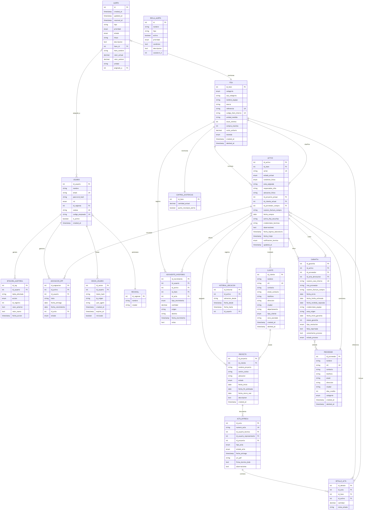

# Diccionario de Datos y Diagrama de Relaciones — SIGAI-SES

<p align="center">
  
  
  
  
</p>

---

## 1. Diagrama Entidad-Relación

<p align="center">
  
</p>

> [!NOTE]
> El diagrama completo muestra las **18 tablas** organizadas en **7 módulos funcionales** con sus relaciones y cardinalidades.

---

## 2. Definición Detallada de Tablas

---

### Módulo de Seguridad y Acceso

#### `usuarios`

> Gestión de accesos y perfiles de usuario del sistema.

| # | Campo | Tipo | | Descripción |
|---|---|---|---|---|
| 1 | `id_usuario` | `INTEGER` | **PK** | Identificador único del usuario |
| 2 | `nombre` | `VARCHAR(100)` | — | Nombre completo del usuario |
| 3 | `email` | `VARCHAR(100)` | **UK** | Correo electrónico corporativo (usado para login) |
| 4 | `password_hash` | `VARCHAR(255)` | — | Hash **bcrypt** de la contraseña |
| 5 | `rol` | `ENUM('ADMIN','TECNICO','TECNICO_LABORATORIO')` | — | Perfil de acceso |
| 6 | `id_regional` | `INTEGER` | **FK** → `regionales` | Regional a la que pertenece |
| 7 | `cedula` | `VARCHAR(20)` | **UK** | Número de cédula de ciudadanía |
| 8 | `codigo_empleado` | `VARCHAR(20)` | **UK** | Código interno de empleado Securitas |
| 9 | `regional` | `VARCHAR(100)` | — | Nombre de regional (campo auxiliar) |
| 10 | `is_active` | `BOOLEAN` | — | Indica si la cuenta está activa |
| 11 | `created_at` | `TIMESTAMP` | — | Fecha de creación del registro |

#### `regionales`

> Ciudades o regiones donde opera Securitas Colombia.

| # | Campo | Tipo | | Descripción |
|---|---|---|---|---|
| 1 | `id_regional` | `INTEGER` | **PK** | Identificador único |
| 2 | `nombre` | `VARCHAR(100)` | — | Nombre de la regional |
| 3 | `ciudad` | `VARCHAR(100)` | — | Ciudad principal de la regional |

#### `sesiones_usuario`

> Control de sesiones activas para revocación y auditoría.

| # | Campo | Tipo | | Descripción |
|---|---|---|---|---|
| 1 | `id_sesion` | `INTEGER` | **PK** | Identificador único de sesión |
| 2 | `id_usuario` | `INTEGER` | **FK** → `usuarios` (CASCADE) | Usuario de la sesión |
| 3 | `token_hash` | `VARCHAR(64)` | — | Hash SHA-256 del token JWT |
| 4 | `ip_origen` | `VARCHAR(45)` | — | Dirección IP de origen |
| 5 | `user_agent` | `VARCHAR(255)` | — | User-Agent del navegador |
| 6 | `created_at` | `TIMESTAMP` | — | Inicio de sesión |
| 7 | `expires_at` | `TIMESTAMP` | — | Fecha de expiración del token |
| 8 | `revocado` | `BOOLEAN` | — | Indica si la sesión fue revocada manualmente |

---

### Módulo de Inventario

#### `items`

> Catálogo general de productos y equipos gestionados por el sistema.

| # | Campo | Tipo | | Descripción |
|---|---|---|---|---|
| 1 | `id_item` | `INTEGER` | **PK** | Identificador único del item |
| 2 | `categoria` | `ENUM(8 valores)` | — | Categoría del equipo |
| 3 | `sub_categoria` | `VARCHAR(100)` | — | Subcategoría del equipo |
| 4 | `nombre_equipo` | `VARCHAR(255)` | — | Nombre comercial del producto |
| 5 | `marca` | `VARCHAR(100)` | — | Marca del fabricante |
| 6 | `referencia` | `VARCHAR(100)` | **UK** | Referencia o modelo del fabricante |
| 7 | `codigo_item_interno` | `VARCHAR(50)` | **UK** | Código interno SAP/CECO de Securitas |
| 8 | `unidad_medida` | `VARCHAR(20)` | — | Unidad de medida (UND, PAR, MTS, etc.) |
| 9 | `stock_minimo` | `INTEGER` | — | Cantidad mínima para alerta de reabastecimiento |
| 10 | `compra_maxima` | `INTEGER` | — | Cantidad máxima por orden de compra |
| 11 | `costo_unitario` | `DECIMAL(12,2)` | — | Costo unitario del item |
| 12 | `moneda` | `ENUM('COP','USD','EUR')` | — | Moneda del costo |
| 13 | `created_at` | `TIMESTAMP` | — | Fecha de creación |
| 14 | `deleted_at` | `TIMESTAMP` | — | **Soft delete** (NULL = activo) |

#### `activos`

> Unidades físicas únicas identificadas por número de serie.

| # | Campo | Tipo | | Descripción |
|---|---|---|---|---|
| 1 | `id_activo` | `INTEGER` | **PK** | Identificador único del activo |
| 2 | `id_item` | `INTEGER` | **FK** → `items` | Referencia al catálogo de items |
| 3 | `serial` | `VARCHAR(100)` | **UK** | Número de serie del equipo |
| 4 | `estado_actual` | `ENUM(8 valores)` | — | Estado operativo actual |
| 5 | `condicion_fisica` | `ENUM(6 valores)` | — | Condición física evaluada |
| 6 | `area_asignada` | `VARCHAR(100)` | — | Área específica del cliente donde está instalado |
| 7 | `responsable_sitio` | `VARCHAR(100)` | — | Persona responsable en sitio del cliente |
| 8 | `ubicacion_fisica` | `VARCHAR(255)` | — | Ubicación física (bodega, estante, rack) |
| 9 | `id_proyecto_actual` | `INTEGER` | **FK** → `proyectos` | Proyecto al que está asignado |
| 10 | `id_cliente_actual` | `INTEGER` | **FK** → `clientes` | Cliente donde está instalado |
| 11 | `id_proveedor_compra` | `INTEGER` | **FK** → `proveedores` | Proveedor que suministró el equipo |
| 12 | `numero_factura_compra` | `VARCHAR(50)` | — | Factura de compra del equipo |
| 13 | `fecha_compra` | `DATE` | — | Fecha de adquisición |
| 14 | `activo_fijo_securitas` | `VARCHAR(50)` | — | Placa de activo fijo de Securitas |
| 15 | `credenciales_tecnicas` | `VARCHAR(255)` | — | Credenciales de acceso (IP, usuario, password) |
| 16 | `observaciones` | `TEXT` | — | Notas y observaciones generales |
| 17 | `fecha_ingreso_laboratorio` | `TIMESTAMP` | — | Fecha de ingreso a laboratorio (desmontes) |
| 18 | `fecha_triaje` | `TIMESTAMP` | — | Fecha de evaluación técnica |
| 19 | `calificacion_tecnica` | `ENUM('BUENO','RECUPERABLE','DESECHO')` | — | Resultado de evaluación técnica (triaje) |
| 20 | `updated_at` | `TIMESTAMP` | — | Última actualización |

#### `stock_bulk` — Control de Existencias

> Resumen de cantidades disponibles para items de inventario **bulk**.

| # | Campo | Tipo | | Descripción |
|---|---|---|---|---|
| 1 | `id_item` | `INTEGER` | **PK** /  **FK** → `items` | Referencia al item |
| 2 | `cantidad_actual` | `DECIMAL(12,2)` | — | Cantidad disponible en stock |
| 3 | `punto_recompra_alerta` | `BOOLEAN` | — | Indica si se superó el umbral de recompra |

#### `movimientos_inventario`

> Registro histórico e inmutable de todos los movimientos de inventario (**Kardex Digital**).

| # | Campo | Tipo | | Descripción |
|---|---|---|---|---|
| 1 | `id_movimiento` | `INTEGER` | **PK** | Identificador único del movimiento |
| 2 | `id_usuario` | `INTEGER` | **FK** → `usuarios` | Usuario que realizó el movimiento |
| 3 | `id_activo` | `INTEGER` | **FK** → `activos` | Activo involucrado (si aplica) |
| 4 | `id_item` | `INTEGER` | **FK** → `items` | Item involucrado |
| 5 | `id_acta` | `INTEGER` | **FK** → `actas_entrega` | Acta de entrega asociada (si aplica) |
| 6 | `tipo_movimiento` | `ENUM(7 valores)` | — | Tipo de movimiento |
| 7 | `cantidad` | `DECIMAL(12,2)` | — | Cantidad movida |
| 8 | `origen` | `VARCHAR(100)` | — | Ubicación de origen |
| 9 | `destino` | `VARCHAR(100)` | — | Ubicación de destino |
| 10 | `fecha_movimiento` | `TIMESTAMP` | — | Fecha y hora del movimiento |
| 11 | `notas` | `TEXT` | — | Notas u observaciones |

#### `historial_ubicaciones`

> Trazabilidad de ubicaciones físicas de cada activo a lo largo del tiempo.

| # | Campo | Tipo | | Descripción |
|---|---|---|---|---|
| 1 | `id_historial` | `INTEGER` | **PK** | Identificador único |
| 2 | `id_activo` | `INTEGER` | **FK** → `activos` | Activo cuyo historial se registra |
| 3 | `ubicacion_desde` | `VARCHAR(255)` | — | Ubicación registrada |
| 4 | `fecha_desde` | `TIMESTAMP` | — | Inicio del período en esta ubicación |
| 5 | `fecha_hasta` | `TIMESTAMP` | — | Fin del período (NULL si es la actual) |
| 6 | `id_usuario` | `INTEGER` | **FK** → `usuarios` | Usuario que registró el cambio |

#### `epp_asignaciones`

> Control de entrega de **Elementos de Protección Personal** a técnicos.

| # | Campo | Tipo | | Descripción |
|---|---|---|---|---|
| 1 | `id_asignacion` | `INTEGER` | **PK** | Identificador único |
| 2 | `id_activo` | `INTEGER` | **FK** → `activos` | Activo EPP asignado |
| 3 | `id_usuario` | `INTEGER` | **FK** → `usuarios` | Técnico que recibe el EPP |
| 4 | `talla` | `VARCHAR(10)` | — | Talla del EPP (si aplica) |
| 5 | `fecha_entrega` | `DATE` | — | Fecha de entrega |
| 6 | `fecha_vencimiento` | `DATE` | — | Fecha de vencimiento o renovación |
| 7 | `id_acta` | `INTEGER` | **FK** → `actas_entrega` | Acta de entrega asociada |
| 8 | `estado` | `ENUM('ACTIVO','DEVUELTO','VENCIDO','PERDIDO')` | — | Estado de la asignación |

---

### Módulo de Garantías

#### `garantias`

> Registro de casos de garantía para activos con seguimiento del ciclo de vida.

| # | Campo | Tipo | | Descripción |
|---|---|---|---|---|
| 1 | `id_garantia` | `INTEGER` | **PK** | Identificador único del caso |
| 2 | `id_activo` | `INTEGER` | **FK** → `activos` | Activo cubierto por la garantía |
| 3 | `id_proveedor` | `INTEGER` | **FK** → `proveedores` | Proveedor que atiende la garantía |
| 4 | `id_acta_devolucion` | `INTEGER` | **FK** → `actas_entrega` | Acta de devolución asociada |
| 5 | `numero_caso_interno` | `VARCHAR(50)` | **UK** | Número de caso interno **GSES-XXX** |
| 6 | `rma_proveedor` | `VARCHAR(50)` | — | Número de autorización de devolución (RMA) |
| 7 | `numero_factura_compra` | `VARCHAR(50)` | — | Factura de compra del equipo |
| 8 | `fecha_envio` | `DATE` | — | Fecha de envío al proveedor |
| 9 | `fecha_limite_estimada` | `DATE` | — | Fecha límite estimada de respuesta |
| 10 | `fecha_recibido_reparado` | `DATE` | — | Fecha de recepción del equipo reparado |
| 11 | `credenciales_equipo` | `VARCHAR(255)` | — | Credenciales del equipo enviado |
| 12 | `area_origen` | `VARCHAR(100)` | — | Área de donde proviene el equipo |
| 13 | `fecha_inicio_garantia` | `DATE` | — | Inicio del período de garantía |
| 14 | `meses_garantia` | `INTEGER` | — | Duración de la garantía en meses |
| 15 | `tipo_resolucion` | `ENUM(4 valores)` | — | Tipo de resolución final |
| 16 | `falla_reportada` | `TEXT` | — | Descripción detallada de la falla |
| 17 | `comentarios_proceso` | `TEXT` | — | Comentarios y notas del proceso |
| 18 | `estado_proceso` | `ENUM(5 valores)` | — | Estado actual del flujo de garantía |

---

### Módulo de Entregas

#### `actas_entrega`

> Documentos digitales que formalizan la entrega de equipos.

| # | Campo | Tipo | | Descripción |
|---|---|---|---|---|
| 1 | `id_acta` | `INTEGER` | **PK** | Identificador único del acta |
| 2 | `numero_acta` | `VARCHAR(50)` | **UK** | Número único del acta |
| 3 | `id_usuario_tecnico` | `INTEGER` | **FK** → `usuarios` | Técnico que recibe/entrega |
| 4 | `id_usuario_representante` | `INTEGER` | **FK** → `usuarios` | Representante que firma |
| 5 | `id_proyecto` | `INTEGER` | **FK** → `proyectos` | Proyecto asociado |
| 6 | `tipo_acta` | `ENUM(5 valores)` | — | Tipo de acta |
| 7 | `estado_acta` | `ENUM('BORRADOR','FIRMADA','ANULADA')` | — | Estado del acta |
| 8 | `fecha_entrega` | `TIMESTAMP` | — | Fecha de creación/firma |
| 9 | `url_pdf` | `VARCHAR(255)` | — | Ruta al archivo PDF generado |
| 10 | `firma_tecnico_blob` | `TEXT` | — | Datos de la firma digital (base64) |
| 11 | `observaciones` | `TEXT` | — | Observaciones generales |

#### `detalles_acta_entrega`

> Líneas de detalle de cada acta de entrega.

| # | Campo | Tipo | | Descripción |
|---|---|---|---|---|
| 1 | `id_detalle` | `INTEGER` | **PK** | Identificador único |
| 2 | `id_acta` | `INTEGER` | **FK** → `actas_entrega` | Acta a la que pertenece |
| 3 | `id_item` | `INTEGER` | **FK** → `items` | Item entregado |
| 4 | `id_activo` | `INTEGER` | **FK** → `activos` | Activo específico (si aplica) |
| 5 | `cantidad` | `DECIMAL(12,2)` | — | Cantidad entregada |
| 6 | `notas_estado` | `VARCHAR(255)` | — | Estado del equipo al momento de entrega |

---

### Módulo de Negocio

#### `clientes`

> Empresas clientes de Securitas que reciben servicios o equipos.

| # | Campo | Tipo | | Descripción |
|---|---|---|---|---|
| 1 | `id_cliente` | `INTEGER` | **PK** | Identificador único |
| 2 | `nombre` | `VARCHAR(200)` | — | Razón social o nombre del cliente |
| 3 | `nit` | `VARCHAR(20)` | **UK** | Número de identificación tributaria |
| 4 | `contacto` | `VARCHAR(100)` | — | Nombre del contacto principal |
| 5 | `email_contacto` | `VARCHAR(100)` | — | Correo del contacto |
| 6 | `telefono` | `VARCHAR(50)` | — | Teléfono de contacto |
| 7 | `direccion` | `VARCHAR(255)` | — | Dirección principal |
| 8 | `ciudad` | `VARCHAR(100)` | — | Ciudad |
| 9 | `departamento` | `VARCHAR(100)` | — | Departamento |
| 10 | `tipo_cliente` | `ENUM('CORPORATIVO','INTERNO','GENERAL')` | — | Tipo de cliente |
| 11 | `ceco_asociado` | `VARCHAR(20)` | — | Centro de costos asociado |
| 12 | `created_at` | `TIMESTAMP` | — | Fecha de creación |
| 13 | `deleted_at` | `TIMESTAMP` | — | **Soft delete** |

#### `proveedores`

> Proveedores de equipos y servicios de reparación.

| # | Campo | Tipo | | Descripción |
|---|---|---|---|---|
| 1 | `id_proveedor` | `INTEGER` | **PK** | Identificador único |
| 2 | `nombre` | `VARCHAR(200)` | — | Razón social del proveedor |
| 3 | `nit` | `VARCHAR(20)` | **UK** | NIT del proveedor |
| 4 | `contacto` | `VARCHAR(100)` | — | Nombre del contacto |
| 5 | `telefono` | `VARCHAR(50)` | — | Teléfono |
| 6 | `email` | `VARCHAR(100)` | — | Correo electrónico |
| 7 | `direccion` | `VARCHAR(255)` | — | Dirección |
| 8 | `ciudad` | `VARCHAR(100)` | — | Ciudad |
| 9 | `dias_credito` | `INTEGER` | — | Días de crédito (default 30) |
| 10 | `categoria` | `ENUM(4 valores)` | — | Categoría del proveedor |
| 11 | `created_at` | `TIMESTAMP` | — | Fecha de creación |
| 12 | `deleted_at` | `TIMESTAMP` | — | **Soft delete** |

#### `proyectos`

> Proyectos de instalación o mantenimiento en clientes.

| # | Campo | Tipo | | Descripción |
|---|---|---|---|---|
| 1 | `id_proyecto` | `INTEGER` | **PK** | Identificador único |
| 2 | `id_cliente` | `INTEGER` | **FK** → `clientes` | Cliente del proyecto |
| 3 | `nombre_proyecto` | `VARCHAR(200)` | — | Nombre del proyecto |
| 4 | `centro_costos` | `VARCHAR(50)` | — | Centro de costos |
| 5 | `ubicacion` | `VARCHAR(200)` | — | Ubicación del proyecto |
| 6 | `estado` | `ENUM('ACTIVO','FINALIZADO','PAUSADO')` | — | Estado del proyecto |
| 7 | `fecha_inicio` | `DATE` | — | Fecha de inicio |
| 8 | `fecha_fin_estimada` | `DATE` | — | Fecha estimada de finalización |
| 9 | `fecha_cierre_real` | `DATE` | — | Fecha real de cierre |
| 10 | `descripcion` | `TEXT` | — | Descripción del proyecto |
| 11 | `created_at` | `TIMESTAMP` | — | Fecha de creación |

---

### Módulo de Auditoría

#### `audit_logs` — Bitácora de Auditoría

> Registro histórico e **inviolable** de todas las acciones realizadas en el sistema.

| # | Campo | Tipo | | Descripción |
|---|---|---|---|---|
| 1 | `id_log` | `INTEGER` | **PK** | Identificador único del log |
| 2 | `id_usuario` | `INTEGER` | **FK** → `usuarios` | Usuario que realizó la acción |
| 3 | `tabla_afectada` | `VARCHAR(50)` | — | Nombre de la tabla modificada |
| 4 | `accion` | `ENUM('CREATE','UPDATE','DELETE','LOGIN')` | — | Tipo de acción ejecutada |
| 5 | `id_registro` | `INTEGER` | — | ID del registro afectado |
| 6 | `valor_anterior` | `TEXT` | — | Valor del registro **antes** del cambio (JSON) |
| 7 | `valor_nuevo` | `TEXT` | — | Valor del registro **después** del cambio (JSON) |
| 8 | `fecha_accion` | `TIMESTAMP` | — | Fecha y hora de la acción |

---

### Módulo de Alertas

#### `alerts`

> Notificaciones del sistema generadas automáticamente por reglas de negocio.

| # | Campo | Tipo | | Descripción |
|---|---|---|---|---|
| 1 | `id` | `INTEGER` | **PK** | Identificador único |
| 2 | `created_at` | `TIMESTAMP` | — | Fecha de creación |
| 3 | `updated_at` | `TIMESTAMP` | — | Última actualización |
| 4 | `resolved_at` | `TIMESTAMP` | — | Fecha de resolución |
| 5 | `tipo` | `VARCHAR(50)` | — | Tipo de alerta (`stock_bajo`, `garantia_estancada`, etc.) |
| 6 | `prioridad` | `ENUM('critica','alta','media','baja')` | — | Nivel de prioridad |
| 7 | `estado` | `ENUM('activa','reconocida','resuelta','ignorada')` | — | Estado actual |
| 8 | `titulo` | `VARCHAR(200)` | — | Título de la alerta |
| 9 | `descripcion` | `TEXT` | — | Descripción detallada |
| 10 | `item_id` | `INTEGER` | **FK** → `items` | Item relacionado |
| 11 | `item_nombre` | `VARCHAR(200)` | — | Nombre del item (cache) |
| 12 | `valor_actual` | `DECIMAL(10,2)` | — | Valor actual que disparó la alerta |
| 13 | `valor_umbral` | `DECIMAL(10,2)` | — | Valor umbral configurado |
| 14 | `unidad` | `VARCHAR(20)` | — | Unidad de medida |
| 15 | `asignado_a` | `INTEGER` | **FK** → `usuarios` | Usuario responsable de atender la alerta |

#### `alert_rules`

> Reglas configuradas para la generación automática de alertas.

| # | Campo | Tipo | | Descripción |
|---|---|---|---|---|
| 1 | `id` | `INTEGER` | **PK** | Identificador único |
| 2 | `nombre` | `VARCHAR(100)` | — | Nombre de la regla |
| 3 | `tipo` | `VARCHAR(50)` | — | Tipo de regla |
| 4 | `activa` | `BOOLEAN` | — | Indica si la regla está activa |
| 5 | `prioridad` | `ENUM('critica','alta','media','baja')` | — | Prioridad de las alertas generadas |
| 6 | `condicion` | `TEXT` | — | Condición en formato JSON |
| 7 | `descripcion` | `TEXT` | — | Descripción de la regla |
| 8 | `cooldown_h` | `INTEGER` | — | Horas de espera entre alertas del mismo tipo |

---

## 3. Relaciones Clave

### Jerarquía de Inventario

```
Item (Catálogo) ──> Activo (Unidad Física)
                  ──> StockBulk (Cantidad Agregada)
```

### Ciclo de Auditoría

```
Usuario --> Acción (CRUD) --> AuditLog (Registro Inmutable)
```

### Flujo de Garantías

```
Activo --> Garantía (Caso) --> Proveedor (RMA) --> Resolución
```

### Entregas y Movimientos

```
ActaEntrega --> DetalleActa --> Items / Activos
MovimientoInventario --> Kardex Digital
```

---

<details>
<summary><b>Click para ver resumen de módulos y tablas</b></summary>

<br>

| Módulo | Tablas | Relaciones Clave |
|---|---|---|
| **Seguridad y Acceso** | `usuarios`, `regionales`, `sesiones_usuario` | Usuarios → Regionales · Sesiones → Usuarios |
| **Inventario** | `items`, `activos`, `stock_bulk`, `movimientos_inventario`, `historial_ubicaciones`, `epp_asignaciones` | Activos → Items · Movimientos → Activos/Items |
| **Garantías** | `garantias` | Garantías → Activos → Proveedores |
| **Entregas** | `actas_entrega`, `detalles_acta_entrega` | Detalles → Actas → Items/Activos |
| **Negocio** | `clientes`, `proveedores`, `proyectos` | Proyectos → Clientes |
| **Auditoría** | `audit_logs` | Audit → Usuarios |
| **Alertas** | `alerts`, `alert_rules` | Alerts → Items/Usuarios |

</details>

---

<p align="center">
  <b>SIGAI-SES</b> — <i>Sistema Integral de Gestión de Activos e Inventario</i><br><br>
  <br>
   v2.0 — Completo con 18 tablas · 7 módulos
</p>


