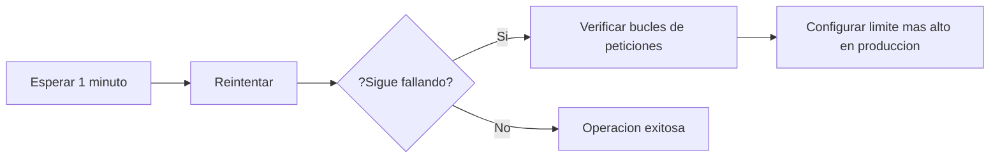

# Catalogo de Errores de API -- SIGAI-SES


---

## Introduccion

> [!TIP]
> Este documento cataloga los **codigos de error HTTP** y los **mensajes de error** que la API REST de SIGAI-SES puede devolver. Sirve como referencia para **desarrolladores y administradores** al depurar problemas en la integracion o el consumo de la API.

---

## Codigos de Estado HTTP

### Exitosos (2xx)

| Codigo | Significado | Uso |
|--------|-------------|--------|
| **200** | **OK** | Peticion exitosa (GET, PUT, PATCH) |
| **201** | **Created** | Recurso creado exitosamente (POST) |
| **204** | **No Content** | Peticion exitosa sin contenido (DELETE) |

### Redirecciones (3xx)

| Codigo | Significado | Uso |
|--------|-------------|--------|
| **304** | **Not Modified** | Recurso no modificado (cache) |

### Errores del Cliente (4xx)

| Codigo | Significado | Uso |
|--------|-------------|--------|
| **400** | **Bad Request** | Datos de entrada invalidos (validacion Pydantic fallida) |
| **401** | **Unauthorized** | Token JWT faltante, invalido o expirado |
| **403** | **Forbidden** | Token valido pero sin permisos suficientes (rol incorrecto) |
| **404** | **Not Found** | Recurso solicitado no existe |
| **409** | **Conflict** | Conflicto de unicidad (email, serial, NIT duplicado) |
| **422** | **Unprocessable Entity** | Error de validacion de datos (schemas Pydantic) |
| **429** | **Too Many Requests** | Rate limit excedido (10 req/min en login) |

### Errores del Servidor (5xx)

| Codigo | Significado | Uso |
|--------|-------------|--------|
| **500** | **Internal Server Error** | Error no controlado en el servidor |
| **502** | **Bad Gateway** | Error de comunicacion con BD (aiomysql) |
| **503** | **Service Unavailable** | Servicio en mantenimiento o sobrecargado |
| **504** | **Gateway Timeout** | Timeout en conexion a BD (pool agotado) |

---

## Mensajes de Error por Endpoint

### 3.1 Autenticacion (`/api/v1/auth`)

| Endpoint | HTTP | Mensaje de Error | Causa |
|----------|------|---------------------|----------|
| `POST /login` | 401 | `"Incorrect email or password"` | Email o contrasena incorrectos |
| `POST /login` | 429 | `"Rate limit exceeded: 10 per 1 minute"` | Demasiados intentos de login |
| `POST /refresh` | 401 | `"Invalid refresh token"` | Refresh token invalido o expirado |
| `POST /refresh` | 401 | `"Refresh token has been revoked"` | Sesion revocada manualmente |
| `POST /register` | 400 | `"Email already registered"` | Email ya existe en el sistema |
| `POST /register` | 403 | `"Not enough permissions"` | El usuario no es ADMIN |
| `GET /me` | 401 | `"Not authenticated"` | Token faltante o invalido |
| `GET /me` | 401 | `"Token has expired"` | Access token expirado |

### 3.2 Usuarios (`/api/v1/users`)

| Endpoint | HTTP | Mensaje de Error | Causa |
|----------|------|---------------------|----------|
| `POST /` | 400 | `"Email already registered"` | Email ya existe en BD |
| `POST /` | 400 | `"Cedula already registered"` | Cedula ya registrada |
| `POST /` | 400 | `"Employee code already registered"` | Codigo de empleado duplicado |
| `PUT /{id}` | 404 | `"User not found"` | ID de usuario no existe |
| `PUT /{id}` | 403 | `"Cannot modify your own role"` | ADMIN intenta cambiar su propio rol |
| `DELETE /{id}` | 404 | `"User not found"` | ID de usuario no existe |
| `DELETE /{id}` | 400 | `"Cannot delete yourself"` | Intento de auto-eliminacion |
| `PUT /me/password` | 400 | `"Current password is incorrect"` | Contrasena actual no coincide |
| `POST /me/avatar` | 400 | `"File too large. Max 2MB"` | Archivo de avatar excede el limite |

### 3.3 Inventario (`/api/v1/inventory`)

| Endpoint | HTTP | Mensaje de Error | Causa |
|----------|------|---------------------|----------|
| `POST /items` | 400 | `"Reference already exists"` | Referencia de fabricante duplicada |
| `POST /items` | 400 | `"Internal code already exists"` | Codigo SAP/CECO duplicado |
| `GET /items/{id}` | 404 | `"Item not found"` | ID de item no existe |
| `POST /activos` | 400 | `"Serial already exists"` | Serial de equipo ya registrado |
| `POST /activos` | 400 | `"Invalid estado_actual"` | Estado del activo no es valido |
| `GET /activos/{serial}` | 404 | `"Activo not found"` | Serial no encontrado |
| `PATCH /activos/{id}/triaje` | 400 | `"Invalid calificacion_tecnica"` | Calificacion invalida |
| `PATCH /activos/{id}/triaje` | 400 | `"Activo is not in LABORATORIO state"` | Activo no esta en laboratorio |
| `POST /items/desmonte-bulk` | 400 | `"No valid serials found in file"` | Excel sin seriales validos |

### 3.4 Negocio (`/api/v1/business`)

| Endpoint | HTTP | Mensaje de Error | Causa |
|----------|------|---------------------|----------|
| `POST /clientes` | 400 | `"NIT already exists"` | NIT de cliente duplicado |
| `GET /clientes/{id}` | 404 | `"Client not found"` | ID de cliente no existe |
| `DELETE /clientes/{id}` | 400 | `"Client has active projects"` | Cliente tiene proyectos activos |
| `POST /proyectos` | 400 | `"Project name already exists for this client"` | Nombre duplicado para el cliente |
| `POST /garantias` | 400 | `"Case number already exists"` | Numero de caso GSES duplicado |
| `POST /garantias` | 400 | `"Activo is not in valid state for guarantee"` | Estado invalido para garantia |
| `POST /actas` | 400 | `"Acta number already exists"` | Numero de acta duplicado |
| `POST /actas` | 400 | `"No items provided"` | Acta sin items no se puede crear |
| `POST /actas/{id}/generate` | 404 | `"Acta not found"` | ID de acta no existe |
| `POST /actas/{id}/generate` | 400 | `"Acta is already finalized"` | Acta ya esta firmada |

### 3.5 Alertas (`/api/v1/alerts`)

| Endpoint | HTTP | Mensaje de Error | Causa |
|----------|------|---------------------|----------|
| `GET /` | 400 | `"Invalid filter parameters"` | Filtro invalido |
| `PATCH /{id}/estado` | 404 | `"Alert not found"` | ID de alerta no existe |
| `PATCH /{id}/estado` | 400 | `"Invalid state transition"` | Transicion no valida |
| `DELETE /{id}` | 404 | `"Alert not found"` | ID de alerta no existe |

### 3.6 Importacion (`/api/v1/import`)

| Endpoint | HTTP | Mensaje de Error | Causa |
|----------|------|---------------------|----------|
| `POST /excel` | 400 | `"No file uploaded"` | No se envio archivo |
| `POST /excel` | 400 | `"Invalid file format. Only .xlsx accepted"` | Formato no soportado |
| `POST /excel` | 400 | `"File too large. Max 50MB"` | Archivo excede 50MB |
| `POST /excel` | 422 | `"Required column 'Serial' not found"` | Columna faltante en Excel |
| `POST /excel` | 500 | `"Error processing Excel file"` | Error interno durante procesamiento |

### 3.7 Reportes (`/api/v1/reports`)

| Endpoint | HTTP | Mensaje de Error | Causa |
|----------|------|---------------------|----------|
| `GET /export/{module}` | 404 | `"Module not found. Available: inventory, alerts, clientes, users, guarantees"` | Modulo invalido |
| `GET /export/{module}` | 400 | `"Invalid format. Use 'excel' or 'pdf'"` | Formato invalido |

### 3.8 Monitoreo (`/api/v1/monitoring`)

| Endpoint | HTTP | Mensaje de Error | Causa |
|----------|------|---------------------|----------|
| `GET /health/db` | 503 | `"Database connection failed: timeout"` | No se pudo conectar a MySQL |
| `GET /health/db` | 503 | `"Pool is exhausted"` | Pool de conexiones agotado |

---

## Formato de Respuesta de Error

> [!NOTE]
> Todas las respuestas de error siguen el formato estandar:

```json
{
    "detail": "Mensaje de error descriptivo"
}
```

**Para errores de validacion Pydantic (422):**

```json
{
    "detail": [
        {
            "loc": ["body", "email"],
            "msg": "field required",
            "type": "value_error.missing"
        }
    ]
}
```

---

## Resolucion de Errores Comunes

### Error 401 -- Token expirado

| Paso | Accion |
|------|--------|
| 1 | El frontend intenta refresh automaticamente con el refresh_token |
| 2 | Si el refresh tambien falla, redirige a `/login` |
| 3 | El usuario debe iniciar sesion nuevamente |

### Error 429 -- Rate limit excedido



### Error 502 -- Bad Gateway (BD no disponible)

| # | Accion | Comando |
|---|--------|---------|
| 1 | Verificar que MySQL esta corriendo | `systemctl status mysql` |
| 2 | Verificar DATABASE_URL en .env | `cat .env | grep DATABASE` |
| 3 | Verificar pool de conexiones | Revisar logs de Uvicorn |

### Error "Reference already exists"

> [!TIP]
> La referencia del fabricante debe ser **unica** en el sistema. Si es una actualizacion, usa `PUT` en lugar de `POST`.

### Error "Serial already exists"

> [!WARNING]
> Cada numero de serie debe ser **unico**. Si el equipo ya esta registrado, usa la opcion de **editar** en lugar de crear uno nuevo.

---

## Mapa de Errores por Frecuencia

```
401 Unauthorized       ==================  Muy frecuente
400 Bad Request        ================    Frecuente
404 Not Found          ============        Moderado
409 Conflict           =========           Moderado
500 Internal Error     ====                Raro
429 Rate Limit         ==                  Muy raro
```

---

> [!TIP]
> **Recomendacion:** Integra este catalogo con tu sistema de logging para identificar patrones de error y mejorar la estabilidad del sistema.

---

*Documento actualizado: Julio 2026 -- v1.0*
*Repositorio: [github.com/TU_USUARIO/proyecto-sigai-ses](https://github.com/TU_USUARIO/proyecto-sigai-ses)*
