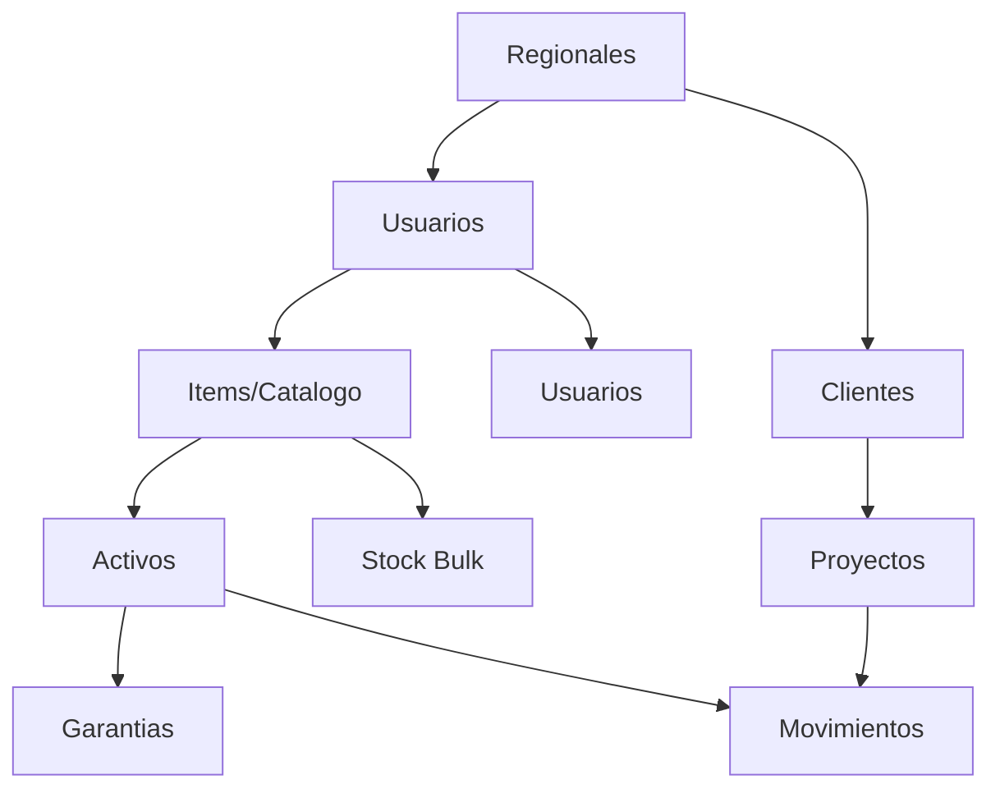

# Guia de Migracion de Datos -- SIGAI-SES


---

## Objetivo

> [!TIP]
> Esta guia describe el proceso para migrar datos desde los sistemas **legacy (archivos Excel)** hacia SIGAI-SES, asegurando la **integridad, consistencia y trazabilidad** de la informacion durante la transicion.

---

## Situacion Actual (Legacy)

Actualmente, la gestion de inventario se realiza mediante **archivos Excel independientes**:

| Archivo | Ubicacion | Registros | Contenido |
|------------|-------------|--------------|--------------|
| `Inventario laboratorio.xlsx` | `DOCUMENTOS/BD_EXCEL/` | **34** filas | Herramientas de laboratorio (marca, descripcion, modelo, cantidad, ubicacion, estado) |
| `Formato Inventario Clientes Corporativos.xlsx` | `DOCUMENTOS/BD_EXCEL/` | **17** filas | Inventario de clientes Procafecol (items, stock, punto de recompra) |
| `Asignacion Numero Caso Garantia.xlsx` | `DOCUMENTOS/BD_EXCEL/` | **147** filas | Casos de garantia con estados y seguimiento |

```
Resumen: ~198 registros totales a migrar
Progreso: [==          ] 20% (pre-migracion)
```

---

## Proceso de Migracion

### 3.1 Pre-migracion

> [!WARNING]
> La limpieza de datos es **critica** para el exito de la migracion. No omitas este paso.

| # | Actividad | Estado |
|---|-----------|-----|
| 1 | Revisar archivos Excel y corregir datos duplicados | [ ] |
| 2 | Corregir seriales o referencias inconsistentes | [ ] |
| 3 | Completar campos vacios obligatorios | [ ] |
| 4 | Unificar formatos de fecha inconsistentes | [ ] |
| 5 | Asegurar que nombres de columna coincidan con plantillas | [ ] |
| 6 | **Conservar** archivos Excel originales en `DOCUMENTOS/BD_EXCEL/` | [ ] |

### 3.2 Orden de Migracion

> [!IMPORTANT]
> La migracion debe realizarse en **este orden estricto** para mantener la integridad referencial.

```
 1.  Regionales        (crear ciudades)
 2.  Usuarios          (crear administrador)
 3.  Items/Catalogo    (crear catalogo)
 4.  Proveedores       (crear proveedores)
 5.  Clientes          (crear clientes)
 6.  Activos           (importar serializados)
 7.  Stock Bulk        (importar consumibles)
 8.  Proyectos         (asociar a clientes)
 9.  Garantias         (importar casos)
10.  Movimientos       (registrar iniciales)
```

**Dependencias entre entidades:**



---

## Migracion Via Importacion Excel

### 4.1 Archivos Soportados

> [!NOTE]
> El motor de importacion (`POST /api/v1/import/excel`) detecta **automaticamente** 3 tipos de archivo.

<details>
<summary>Tipo 1: Inventario de Laboratorio</summary>

| Columna Requerida | Tipo | Descripcion |
|-------------------|------|----------------|
| `Serial` | String | Numero de serie unico del equipo |
| `Referencia` | String | Referencia del fabricante |
| `Marca` | String | Marca del equipo |
| `Equipo` | String | Nombre del equipo |
| `Ubicacion` | String | Ubicacion fisica (estante, bodega) |
| `Estado` | String | Estado actual del equipo |
| `Condicion` | String | Condicion fisica (opcional) |

</details>

<details>
<summary>Tipo 2: Inventario de Clientes Corporativos</summary>

| Columna Requerida | Tipo | Descripcion |
|-------------------|------|----------------|
| `Nombre` | String | Nombre del cliente |
| `NIT` | String | Identificacion tributaria |
| `Contacto` | String | Nombre del contacto |
| `Email` | String | Correo del contacto |
| `Telefono` | String | Telefono |
| `Ciudad` | String | Ciudad |
| `Item` | String | Nombre del item |
| `Referencia` | String | Referencia del item |
| `Stock Actual` | Number | Cantidad en stock |

</details>

<details>
<summary>Tipo 3: Casos de Garantia</summary>

| Columna Requerida | Tipo | Descripcion |
|-------------------|------|----------------|
| `Serial` | String | Serial del equipo en garantia |
| `Caso` | String | Numero de caso (GSES-XXX) |
| `Proveedor` | String | Nombre del proveedor |
| `Fecha Envio` | Date | Fecha de envio al proveedor |
| `Estado` | String | Estado del caso |
| `Falla Reportada` | Text | Descripcion de la falla |

</details>

### 4.2 Ejemplo de Migracion

```bash
# Migrar inventario de laboratorio
curl -X POST http://localhost:8000/api/v1/import/excel \
  -H "Authorization: Bearer <token>" \
  -F "file=@DOCUMENTOS/BD_EXCEL/Inventario laboratorio.xlsx"

# Respuesta esperada:
# {
#   "tipo_detectado": "Inventario Laboratorio",
#   "creados": 25,
#   "actualizados": 9,
#   "errores": 0,
#   "detalles": []
# }
```

---

## Migracion Manual (Via Script)

<details>
<summary>Ver script de importacion manual</summary>

```bash
cd Backend
source .venv/bin/activate

# Importar inventario de laboratorio
python -c "
from app.services.import_service import ImportService
import asyncio

async def run():
    service = ImportService()
    resultado = await service.process_excel('ruta/al/archivo.xlsx')
    print(resultado)

asyncio.run(run())
"
```

</details>

---

## Verificacion Post-Migracion

### 6.1 Verificacion Automatica

```bash
# Verificar total de registros migrados
curl http://localhost:8000/api/v1/analytics/summary

# Verificar items
curl http://localhost:8000/api/v1/inventory/items?limit=10

# Verificar activos
curl http://localhost:8000/api/v1/inventory/activos?limit=10

# Verificar clientes
curl http://localhost:8000/api/v1/business/clientes?limit=10
```

### 6.2 Verificacion Manual

| # | Verificacion | Estado |
|---|-------------|-----|
| 1 | Contar registros en Excel vs sistema | [ ] |
| 2 | Verificar que no hay seriales duplicados | [ ] |
| 3 | Verificar relaciones (items -> activos) correctas | [ ] |
| 4 | Verificar que los usuarios pueden iniciar sesion | [ ] |
| 5 | Verificar que el dashboard muestra datos correctos | [ ] |
| 6 | Verificar alertas de stock bajo se disparan | [ ] |

---

## Rollback de Migracion

> [!WARNING]
> Si la migracion falla o los datos son incorrectos, sigue este procedimiento de **rollback**:

```bash
# 1. Detener el sistema
sudo systemctl stop sigai-backend

# 2. Restaurar BD desde backup pre-migracion
mysql -u sigai -p sigai_ses_db < backup_pre_migracion.sql

# 3. Reiniciar servicios
sudo systemctl start sigai-backend

# 4. Corregir datos en Excel y reintentar migracion
```

---

## Checklists de Migracion

### Pre-migracion

- [ ] Realizar backup completo de BD
- [ ] Exportar archivos Excel originales a `DOCUMENTOS/BD_EXCEL/`
- [ ] Limpiar y estandarizar datos en Excel
- [ ] Verificar que no haya seriales duplicados
- [ ] Verificar que las referencias esten normalizadas

### Durante la migracion

- [ ] Migrar regionales primero
- [ ] Migrar catalogo de items
- [ ] Migrar proveedores y clientes
- [ ] Migrar activos serializados
- [ ] Migrar stock bulk
- [ ] Migrar casos de garantia
- [ ] Migrar proyectos

### Post-migracion

- [ ] Verificar total de registros
- [ ] Verificar integridad referencial
- [ ] Probar login de usuarios
- [ ] Probar busqueda de activos
- [ ] Probar generacion de reportes
- [ ] Probar importacion de un archivo nuevo
- [ ] Documentar resultados de migracion

---

## Estado de Migracion

```
Pre-migracion     [====          ] 40%  [PENDING]
Migracion         [              ]  0%  [PENDING]
Post-migracion    [              ]  0%  [PENDING]
Rollback Ready    [==============] 100% [COMPLETED]
```

---

> [!TIP]
> **Recomendaciones finales:**
> - Realiza la migracion en **horario de bajo impacto** (fin de semana)
> - Ten a mano el **backup pre-migracion** por si necesitas rollback
> - **Documenta cada paso** y cualquier incidencia para futuras migraciones

---

*Documento actualizado: Julio 2026 -- v1.0*
*Repositorio: [github.com/TU_USUARIO/proyecto-sigai-ses](https://github.com/TU_USUARIO/proyecto-sigai-ses)*
