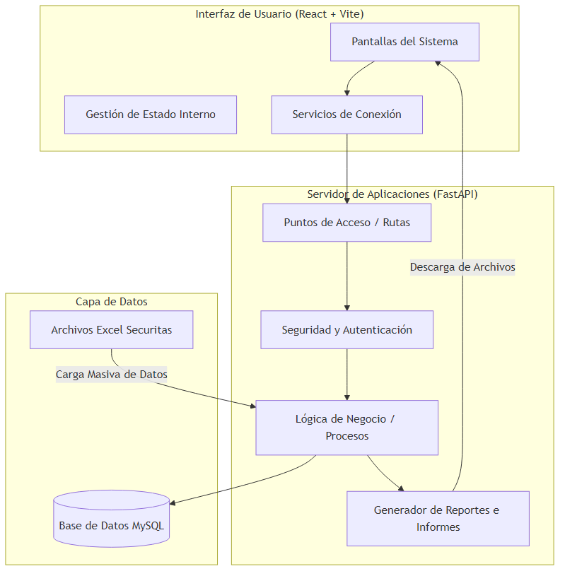
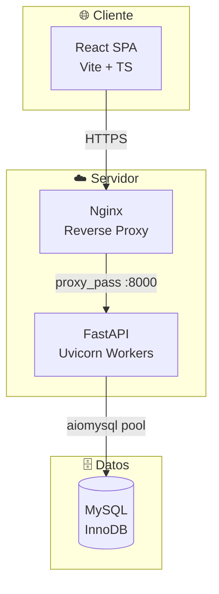
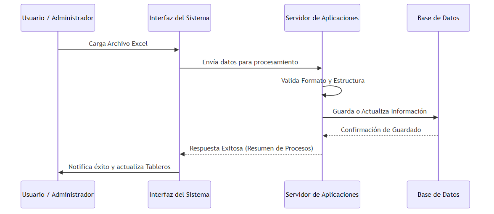
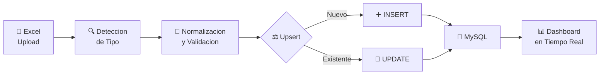
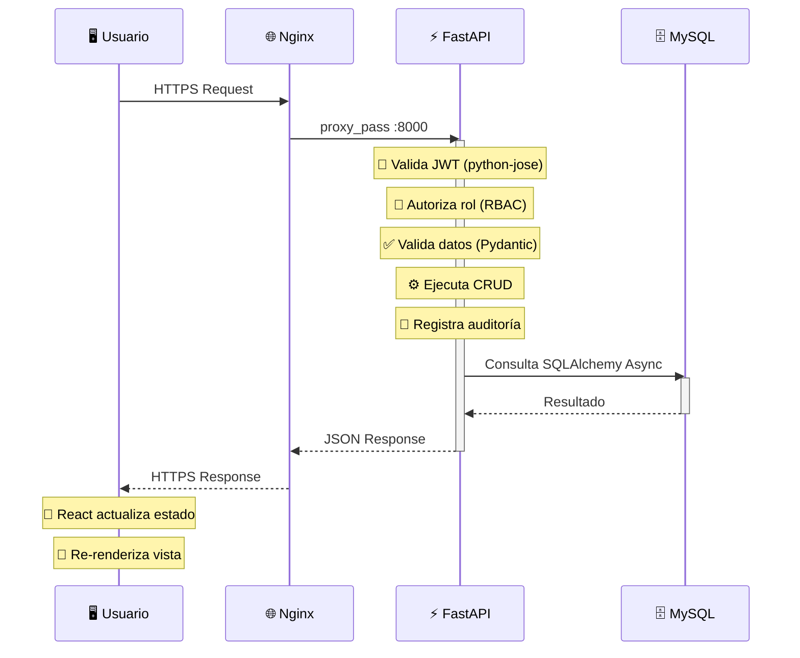
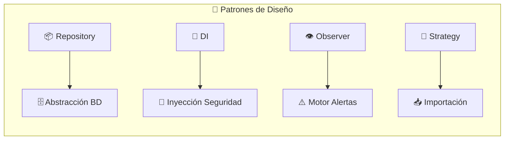

# Arquitectura del Sistema — SIGAI-SES

---

> [!IMPORTANT]
> Este documento describe la **arquitectura global** del SIGAI-SES, incluyendo componentes, flujos de informacion, patrones de diseno y decisiones arquitectonicas clave.

---

## 1. Diagrama de Arquitectura Global

*Modelo de Contenedores — Visión general del sistema*

### Flujo de Comunicación

---

## 2. Diagrama de Flujo de Información

*Excel → Procesamiento → Dashboard*

### Pipeline de Datos

---

## 3. Descripción Detallada de Componentes

---

### 3.1 Interfaz de Usuario (Lado del Cliente)

| Atributo | Detalle |
|:---|---|
| **Framework** |  +  |
| **Bundler** |  |
| **Estilos** |  — **Fusion UI** (Emerald Core × Neomorphic Hub) |
| **HTTP** |  con interceptores JWT |
| **Ruteo** | React Router DOM — **11 rutas** (2 públicas, 9 protegidas) |
| **Estado** | `AuthContext` +  |

#### Módulos del Frontend

| Modulo | Ruta | Rol Mínimo | Descripcion |
|:---:|:---:|:---:|:---|
| Login | `/login` | `Público` | Autenticación con `react-hook-form` |
| Dashboard | `/` | `TECNICO` | KPIs, gráficos, alertas, movimientos |
| Inventario | `/inventory` | `TECNICO` | CRUD items/activos, import/export |
| Clientes | `/clients` | `TECNICO` | CRUD clientes corporativos |
| Proyectos | `/projects` | `TECNICO` | CRUD proyectos con clientes |
| Garantías | `/guarantees` | `TECNICO` | Flujo completo de garantías |
| Alertas | `/alerts` | `TECNICO` | Centro de alertas y gestión |
| Desmontes | `/desmontes` | `TECNICO_LAB` | Triage de equipos |
| Usuarios | `/users` | `ADMIN` | CRUD usuarios, roles, regionales |
| Auditoría | `/audit` | `ADMIN` | Bitácora de cambios |
| Entregas | `/deliveries` | `ADMIN` | Actas de entrega + firma digital |

> [!TIP]
> Los modulos de **Usuarios**, **Auditoria** y **Entregas** son exclusivos para rol `ADMIN`.

---

### 3.2 Servidor de Aplicaciones (Lado del Servidor)

| Atributo | Detalle |
|:---|---|
| **Framework** |  (Python 3.12) |
| **Servidor** |  |
| **ORM** | SQLAlchemy 2.0 Async + aiomysql |
| **Documentación** | OpenAPI 3.0.3 (`/docs`, `/redoc`) |
| **Seguridad** | OAuth2 Password Flow + JWT + bcrypt |
| **Estructura** | **10** módulos API, **7** CRUD, **1** importación |

#### Módulos del Backend

| Modulo API | Endpoints | Descripcion |
|:---|:---:|:---|
| `/api/v1/auth` | `5` | Login, refresh, logout, register, me |
| `/api/v1/users` | `10` | CRUD + audit + settings + avatar |
| `/api/v1/inventory` | `16` | CRUD items, activos, ubicaciones, desmonte-bulk, epp |
| `/api/v1/business` | `20+` | CRUD clientes, proyectos, proveedores, garantías, actas |
| `/api/v1/analytics` | `2` | Summary dashboard, search global |
| `/api/v1/reports` | `1` | Export Excel/PDF (5 módulos) |
| `/api/v1/alerts` | `5` | CRUD alertas + summary + evaluar |
| `/api/v1/regionales` | `1` | Listado de regionales |
| `/api/v1/import` | `2` | Importación Excel (auto-detección) |
| `/api/v1/monitoring` | `3` | Health check, health/db, metrics |

---

### 3.3 Base de Datos y Almacenamiento

| Atributo | Detalle |
|:---|---|
| **Motor** | MySQL 8.0+ / MariaDB 10.5+ (InnoDB) |
| **Pool** | aiomysql — `pool_size=30`, `max_overflow=50` |
| **ORM** | SQLAlchemy 2.0 Async (Base declarativa) |
| **Migraciones** | Alembic — **9 versiones** aplicadas |

#### Tablas del Sistema (18)

| Modulo | Tablas | Descripcion |
|:---|:---|---:|
| Seguridad | `usuarios`, `regionales`, `sesiones_usuario` | Acceso y control |
| Inventario | `items`, `activos`, `stock_bulk`, `movimientos_inventario`, `historial_ubicaciones`, `epp_asignaciones` | Gestión de activos |
| Garantías | `garantias` | Seguimiento RMA |
| Entregas | `actas_entrega`, `detalles_acta_entrega` | Actas digitales |
| Negocio | `clientes`, `proveedores`, `proyectos` | Entidades de negocio |
| Auditoría | `audit_logs` | Registro inmutable |
| Alertas | `alerts`, `alert_rules` | Motor de reglas |
| Vistas | `v_stock_consolidado`, `v_dashboard_kpis` | Vistas materializadas |

> [!NOTE]
> Las **vistas materializadas** se actualizan periódicamente para optimizar consultas del dashboard.

---

## 4. Flujo de Comunicación Detallado

---

## 5. Decisiones Arquitectónicas (ADRs)

| ID | Decisión | Justificación | Alternativas |
|:---:|:---|---:|---:|
| **ADR-01** | **FastAPI** sobre Django | Rendimiento async nativo, tipado con Pydantic, OpenAPI automático | Django REST (síncrono, más pesado) |
| **ADR-02** | **React + Vite** sobre Next.js | SPA ligera, HMR rápido, deploy simple en Vercel | Next.js (SSR complejo para PWA) |
| **ADR-03** | **SQLAlchemy Async** sobre Tortoise ORM | Madurez, documentación, Alembic | Tortoise ORM (menos maduro) |
| **ADR-04** | **JWT en localStorage** sobre httpOnly cookies | Simplicidad, SPA sin SSR | httpOnly cookies (más seguro, pero complejo) |
| **ADR-05** | **MySQL** sobre PostgreSQL | Compatibilidad con MariaDB existente | PostgreSQL (mejor rendimiento, migración compleja) |

> [!WARNING]
> **ADR-04** (JWT en localStorage) es un riesgo de seguridad asumido. Mitigado con expiración de 8h y sesiones revocables.

---

## 6. Patrones de Diseño Utilizados

| Patrón | Ubicación | Proposito |
|:---|:---|---:|
| **Repository** | `app/crud/*.py` | Abstracción de acceso a datos |
| **Dependency Injection** | `app/api/deps.py` | Inyección de dependencias (BD, usuario) |
| **Factory** | `app/models/*.py` | Creación de modelos SQLAlchemy |
| **Singleton** | `app/db/session.py` | Instancia única del engine BD |
| **Observer** | `app/alerts/rules.py` | Motor de reglas → alertas |
| **Strategy** | `app/services/import_service.py` | Estrategia según tipo de archivo |

---

## 7. Seguridad en la Arquitectura

| Capa | Medida | Detalle |
|:---|:---|---:|
| Autenticación | OAuth2 Password Flow | JWT access 8h + refresh 7d |
| Autorización | **RBAC** | `require_roles(["ADMIN", ...])` |
| Aislamiento | Filtro por regional | Obligatorio en consultas |
| Rate Limiting | SlowAPI | 10 req/min en login |
| CORS | Restringido | Solo orígenes en `.env` |
| Auditoría | `audit_logs` | Todas las operaciones CRUD |
| Soft Delete | `deleted_at` | Items, clientes, proveedores |
| Atomicidad | Transacciones | `session.commit()` |

> [!NOTE]
> El **filtro por regional** garantiza que un usuario solo vea datos de su región asignada, implementando aislamiento a nivel de datos.

---

> [!IMPORTANT]
> Para preguntas sobre la arquitectura, contacte al **equipo de arquitectura** en `#sigai-ses-arch` o revise los ADRs completos en `docs/adr/`.
