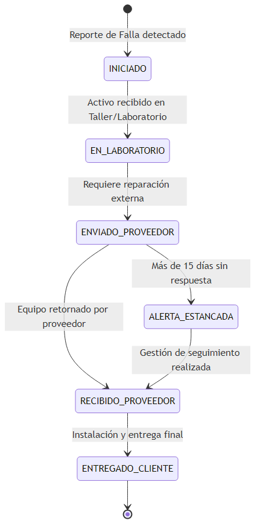
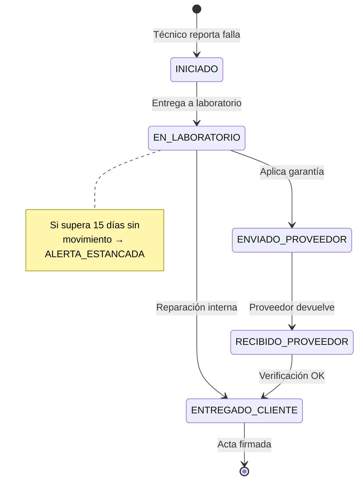
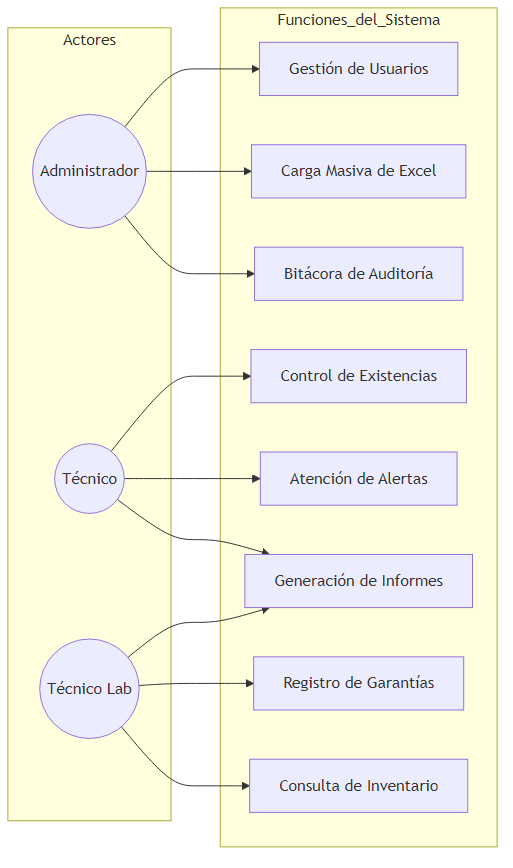
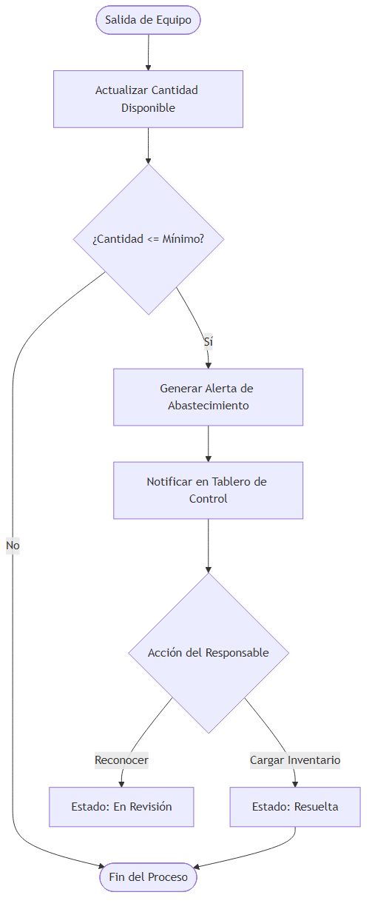
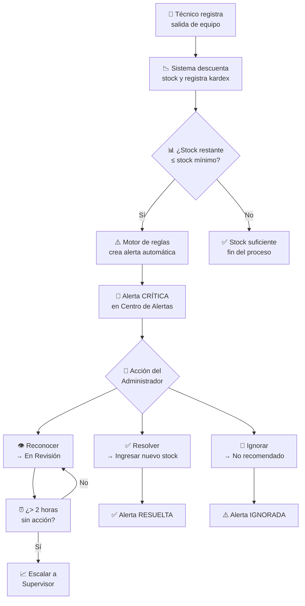

# Diagramas de Procesos y Ciclo de Vida — SIGAI-SES

<div align="center">


</div>

---

> [!TIP]
> Navegación rápida: [1. Garantías](#1-ciclo-de-vida-de-una-garantia) · [2. Perfiles](#2-diagrama-de-funciones-por-perfil-de-usuario) · [3. Alertas Stock](#3-proceso-automatico-de-alerta-por-existencias-criticas) · [4. Actas](#4-flujo-de-creacion-de-acta-de-entrega) · [5. Excel](#5-flujo-de-importacion-excel) · [6. Auth](#6-flujo-de-autenticacion) · [7. Registro](#7-flujo-de-registro-de-usuario-admin)

---

## 1. Ciclo de Vida de una Garantía

<div align="center">



</div>

### Estados del Ciclo

| Estado | Descripcion | Accion Requerida |
|:---:|---|---|
| **INICIADO** | Caso registrado, esperando recepción | Técnico entrega equipo en laboratorio |
| **EN_LABORATORIO** | Equipo en evaluación técnica | Laboratorio diagnostica falla |
| **ENVIADO_PROVEEDOR** | Equipo enviado a reparación | Registrar RMA, fecha envío, factura |
| **RECIBIDO_PROVEEDOR** | Proveedor devolvió equipo reparado | Verificar reparación, actualizar estado |
| **ENTREGADO_CLIENTE** | Equipo instalado y entregado | Generar acta de entrega, cerrar caso |
| **ALERTA_ESTANCADA** | Sin movimiento > 15 días | Acción correctiva requerida |

### Flujo Detallado



**Pasos del proceso:**

| # | Paso | Detalle |
|:---:|---|---|
| 1 | Reporte de falla | Técnico reporta equipo dañado en campo |
| 2 | Generación de caso | Sistema crea número único `GSES-XXX` |
| 3 | Diagnóstico | Equipo ingresa a laboratorio |
| 4 | Evaluación | ¿Aplica garantía? (proveedor o reparación interna) |
| 5 | Envío a proveedor | Se envía con RMA si aplica |
| 6 | Devolución | Proveedor repara/reemplaza y devuelve |
| 7 | Entrega y cierre | Equipo entregado al cliente, caso cerrado |
| 8 | Alerta de estancamiento | Si > 15 días sin movimiento → `ALERTA_ESTANCADA` |

> [!WARNING]
> Si un caso permanece en `EN_LABORATORIO` o `ENVIADO_PROVEEDOR` por más de **15 días**, el sistema automáticamente lo marca como `ALERTA_ESTANCADA`.

---

## 2. Diagrama de Funciones por Perfil de Usuario

<div align="center">



</div>

### Roles del Sistema

| Rol | Funciones Asignadas |
|:---|---|
| **ADMIN** | Gestión usuarios · Carga masiva · Auditoría · Configuración global · Todos los módulos |
| **TECNICO** | Control existencias · Alertas · Informes · Garantías · Entregas · Consulta inventario |
| **TECNICO_LABORATORIO** | Garantías · Inventario · Informes · Triage desmontes · Evaluación técnica |

### Matriz de Permisos Detallada

| Funcion | ADMIN | TECNICO | TECNICO_LAB |
|:---|---:|:---:|:---:|
| Dashboard | **SI** | **SI** | **SI** |
| Ver inventario | **SI** | **SI** | **SI** |
| Crear/Editar items | **SI** | **SI** | **SI** |
| Importar Excel | **SI** | **SI** | **SI** |
| Gestionar garantías | **SI** | **SI** | **SI** |
| Crear alertas | **SI** | **SI** | **NO** |
| Gestionar alertas | **SI** | **SI** | **SI** |
| Crear actas entrega | **SI** | **NO** | **NO** |
| Gestionar usuarios | **SI** | **NO** | **NO** |
| Ver auditoría | **SI** | **NO** | **NO** |
| Realizar triaje | **SI** | **NO** | **SI** |
| Registrar desmontes | **SI** | **NO** | **SI** |
| Gestionar clientes | **SI** | **SI** | **NO** |
| Gestionar proyectos | **SI** | **SI** | **NO** |
| Exportar reportes | **SI** | **SI** | **SI** |

> [!NOTE]
> La creación de **actas de entrega** y **gestión de usuarios** son funciones exclusivas del rol `ADMIN`.

---

## 3. Proceso Automático de Alerta por Existencias Críticas

<div align="center">



</div>

### Flujo Detallado



**Secuencia de eventos:**

| # | Evento | Actor | Descripción |
|:---:|---|---|---|
| 1 | Salida de inventario | Técnico | Registra movimiento de salida |
| 2 | Descuento de stock | Sistema | Actualiza kardex y stock actual |
| 3 | Evaluación de regla | Motor | ¿Stock ≤ stock_minimo? |
| 4 | Creación de alerta | Sistema | Alerta con prioridad **CRÍTICA** |
| 5 | Reconocimiento | Admin | Marca como "En Revisión" |
| 6 | Resolución | Admin | Ingresa nuevo stock |
| 7 | Escalamiento | Sistema | Si > 2h sin reconocer → Supervisor |

> [!TIP]
> La alerta se escala automáticamente al **supervisor** si no es reconocida en **más de 2 horas**. No ignore las alertas críticas.

---

## 4. Flujo de Creación de Acta de Entrega

```
INICIO
  │
  ▼
Seleccionar tipo de acta:
  ├── ENTREGA_EPP
  ├── ENTREGA_HERRAMIENTA
  ├── DESPACHO_PROYECTO
  ├── DEVOLUCION
  └── INGRESO_DESMONTE
  │
  ▼
Seleccionar técnico responsable
  │
  ▼
Seleccionar proyecto/cliente destino
  │
  ▼
Agregar items/activos al acta
  │  (búsqueda por nombre, serial, categoría)
  ▼
Capturar firma digital del técnico
  │  (lienzo táctil react-signature-canvas)
  │
  ▼
Generar PDF del acta (ReportLab)
  │  ├── Logo Securitas
  │  ├── Datos del técnico y representante
  │  ├── Lista de equipos con seriales
  │  ├── Firma digital incrustada
  │  └── Fecha y hora de creación
  │
  ▼
Registrar en BD
  │  ├── actas_entrega
  │  └── detalles_acta_entrega
  │
  ▼
Actualizar kardex de movimientos
  │
  ▼
FIN
```

> [!IMPORTANT]
> La **firma digital** se captura en un lienzo táctil usando `react-signature-canvas` y se incrusta directamente en el PDF generado.

---

## 5. Flujo de Importación Excel

```
INICIO
  │
  ▼
Usuario selecciona archivo Excel (.xlsx)
  │
  ▼
Servidor recibe archivo (multipart/form-data)
  │
  ▼
Detección automática de tipo (por nombre/columnas):
  ├── "Inventario" → Procesa items y activos
  ├── "Inventario Clientes" → Procesa clientes y stock
  └── "Garantia" → Procesa casos de garantía
  │
  ▼
Normalización de datos:
  ├── Limpieza de espacios y caracteres especiales
  ├── Estandarización de mayúsculas/minúsculas
  └── Validación de tipos de datos
  │
  ▼
Validación de columnas obligatorias:
  ├── ¿Faltan columnas? → Error: "Formato no válido"
  └── ¿Todo correcto? → Continuar
  │
  ▼
Procesamiento transaccional:
  │
  Para cada fila:
  │   ├── ¿Existe registro por serial/referencia?
  │   │   ├── Sí → UPDATE (actualizar datos)
  │   │   └── No → INSERT (crear nuevo)
  │   └── Registrar en auditoría
  │
  ▼
Commit transacción (todo o nada)
  │
  ▼
Generar resumen al usuario:
  ├── Registros creados: X
  ├── Registros actualizados: Y
  └── Errores: Z (con detalles)
  │
  ▼
FIN
```

> [!NOTE]
> El proceso es **transaccional**: si falla alguna fila, **todo** se revierte (rollback). No hay importaciones parciales.

---

## 6. Flujo de Autenticación

```
Cliente (Frontend)                    Servidor (Backend)
     │                                          │
     │  POST /auth/login                        │
     │  (email + password)                      │
     │─────────────────────────────────────────>│
     │                                          │  Buscar usuario por email
     │                                          │  Verificar password (bcrypt)
     │                                          │  Generar access_token (8h)
     │                                          │  Generar refresh_token (7d)
     │                                          │  Registrar sesión en BD
     │  {access_token,                          │
     │     refresh_token,                       │
     │     user}                                │
     │<─────────────────────────────────────────│
     │                                          │
     │  Almacenar tokens en localStorage        │
     │  Redirigir a /dashboard                  │
     │                                          │
     │  GET /auth/me                            │
     │  (Bearer access_token)                   │
     │─────────────────────────────────────────>│  Decodificar JWT
     │                                          │  Verificar expiración
     │  {user data}                             │
     │<─────────────────────────────────────────│
     │                                          │
     │  ...operaciones normales...              │
     │                                          │
     │  (access_token EXPIRA a las 8h)          │
     │                                          │
     │  POST /auth/refresh                      │
     │  (refresh_token)                         │
     │─────────────────────────────────────────>│  Verificar refresh token
     │                                          │  Generar NUEVO access_token
     │  {new access_token}                      │
     │<─────────────────────────────────────────│
     │                                          │
     │  Reintentar petición original            │
     │  con nuevo access_token                  │
     │                                          │
     │  ...operaciones normales...              │
     │                                          │
     │  (refresh_token EXPIRA a los 7d)         │
     │                                          │
     │  Intenta renovar → FALLA                 │
     │  Redirigir a /login                      │
     │                                          │
```

> [!TIP]
> El flujo de **refresco automático** está implementado en el **interceptor Axios**. No requiere acción del usuario.

---

## 7. Flujo de Registro de Usuario (Admin)

```
INICIO
  │
  ▼
Administrador navega a Usuarios > "Nuevo Usuario"
  │
  ▼
Completa formulario:
  ├── Nombre completo
  ├── Email corporativo
  ├── Rol (ADMIN, TECNICO, TECNICO_LABORATORIO)
  ├── Regional (ciudad)
  ├── Cédula
  ├── Código de empleado
  └── Contraseña temporal
  │
  ▼
Backend valida:
  ├── ¿Email único? NO → Error "Email ya registrado"
  ├── ¿Cédula única? NO → Error "Cédula ya registrada"
  ├── ¿Código empleado único? NO → Error "Código ya registrado"
  ├── ¿Rol válido? NO → Error
  └── TODO OK → Continuar
  │
  ▼
Backend crea usuario:
  ├── Hash de contraseña (bcrypt)
  ├── is_active = true
  ├── created_at = now
  └── Registra en audit_logs (CREATE)
  │
  ▼
Frontend muestra confirmación
  │
  ▼
(Pendiente v1.1.0) Enviar credenciales por email
  │
  ▼
FIN
```

> [!WARNING]
> El envío de credenciales por **email** está **pendiente para v1.1.0**. Actualmente, el ADMIN debe entregar las credenciales manualmente al nuevo usuario.

---

<div align="center">


</div>

> [!IMPORTANT]
> ¿Sugerencias o mejoras para estos diagramas? Abre un issue en el repositorio con la etiqueta `documentacion`.
