# Diagramas de Procesos y Ciclo de Vida — SIGAI-SES

---

> [!TIP]
> Navegación rápida: [1. Garantías](#1-ciclo-de-vida-de-una-garantia) · [2. Perfiles](#2-diagrama-de-funciones-por-perfil-de-usuario) · [3. Alertas Stock](#3-proceso-automatico-de-alerta-por-existencias-criticas) · [4. Actas](#4-flujo-de-creacion-de-acta-de-entrega) · [5. Excel](#5-flujo-de-importacion-excel) · [6. Auth](#6-flujo-de-autenticacion) · [7. Registro](#7-flujo-de-registro-de-usuario-admin)

---

## 1. Ciclo de Vida de una Garantía {#1-ciclo-de-vida-de-una-garantia}

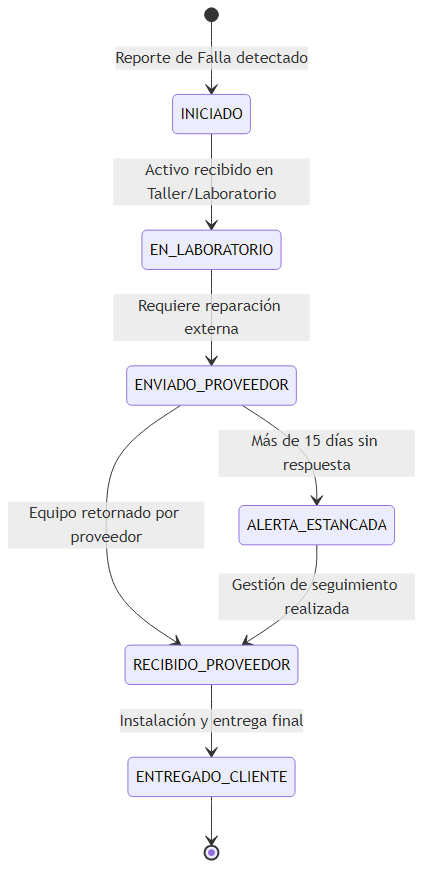

### Estados del Ciclo

| Estado | Descripcion | Accion Requerida |
|:---:|---|---|
| **REGISTRADO** | Caso registrado, esperando recepción | Técnico entrega equipo en laboratorio |
| **ENVIADO_PROVEEDOR** | Equipo enviado a reparación | Registrar RMA, fecha envío, factura |
| **RECIBIDO_PROVEEDOR** | Proveedor devolvió equipo reparado | Verificar reparación, actualizar estado |
| **RESUELTO_REEMPLAZADO** | Caso resuelto (reparado o reemplazado) | Registrar resolución |
| **ENTREGADO_CLIENTE** | Equipo instalado y entregado | Generar acta de entrega, cerrar caso |
| **ALERTA_ESTANCADA** | Sin movimiento > 15 días | Acción correctiva requerida |

### Flujo Detallado

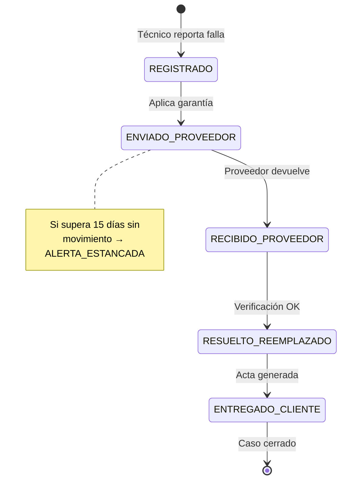
```mermaid
stateDiagram-v2
    [*] --> REGISTRADO: Técnico reporta falla
    REGISTRADO --> ENVIADO_PROVEEDOR: Aplica garantía
    ENVIADO_PROVEEDOR --> RECIBIDO_PROVEEDOR: Proveedor devuelve
    RECIBIDO_PROVEEDOR --> RESUELTO_REEMPLAZADO: Verificación OK
    RESUELTO_REEMPLAZADO --> ENTREGADO_CLIENTE: Acta generada
    ENTREGADO_CLIENTE --> [*]: Caso cerrado

    note right of ENVIADO_PROVEEDOR
        Si supera 15 días sin
        movimiento → ALERTA_ESTANCADA
    end note
```

**Pasos del proceso:**

| # | Paso | Detalle |
|:---:|---|---|
| 1 | Reporte de falla | Técnico reporta equipo dañado en campo |
| 2 | Generación de caso | Sistema crea número único `GSES-XXX` |
| 3 | Envío a proveedor | Se envía con RMA si aplica |
| 4 | Devolución | Proveedor repara/reemplaza y devuelve |
| 5 | Resolución | Caso marcado como `RESUELTO_REEMPLAZADO` |
| 6 | Entrega y cierre | Equipo entregado al cliente, caso cerrado |
| 7 | Alerta de estancamiento | Si > 15 días sin movimiento → `ALERTA_ESTANCADA` |

> [!WARNING]
> Si un caso permanece en `ENVIADO_PROVEEDOR` por más de **15 días**, el sistema automáticamente genera una alerta de `garantia_vencida` (prioridad **alta**).

---

## 2. Diagrama de Funciones por Perfil de Usuario {#2-diagrama-de-funciones-por-perfil-de-usuario}

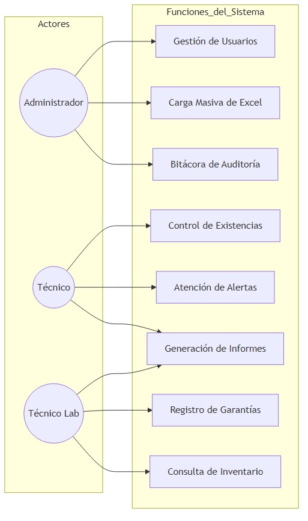

### Roles del Sistema

| Rol | Funciones Asignadas |
|:---|---|
| **ADMIN** | Gestión usuarios · Carga masiva · Auditoría · Configuración global · Todos los módulos |
| **TECNICO** | Control existencias · Alertas · Informes · Garantías · Entregas · Consulta inventario |
| **TECNICO_LABORATORIO** | Garantías · Inventario · Informes · Triage desmontes · Evaluación técnica |

### Matriz de Permisos Detallada

| Funcion | ADMIN | TECNICO | TECNICO_LAB |
|:---|---:|:---:|:---:|
| Dashboard | **SI** | **SI** | **SI** |
| Ver inventario | **SI** | **SI** | **SI** |
| Crear/Editar items | **SI** | **SI** | **SI** |
| Importar Excel | **SI** | **SI** | **SI** |
| Gestionar garantías | **SI** | **SI** | **SI** |
| Crear alertas | **SI** | **SI** | **NO** |
| Gestionar alertas | **SI** | **SI** | **SI** |
| Crear actas entrega | **SI** | **NO** | **NO** |
| Gestionar usuarios | **SI** | **NO** | **NO** |
| Ver auditoría | **SI** | **NO** | **NO** |
| Realizar triaje | **SI** | **NO** | **SI** |
| Registrar desmontes | **SI** | **NO** | **SI** |
| Gestionar clientes | **SI** | **SI** | **NO** |
| Gestionar proyectos | **SI** | **SI** | **NO** |
| Exportar reportes | **SI** | **SI** | **SI** |

> [!NOTE]
> La creación de **actas de entrega** y **gestión de usuarios** son funciones exclusivas del rol `ADMIN`.

---

## 3. Proceso Automático de Alerta por Existencias Críticas {#3-proceso-automatico-de-alerta-por-existencias-criticas}

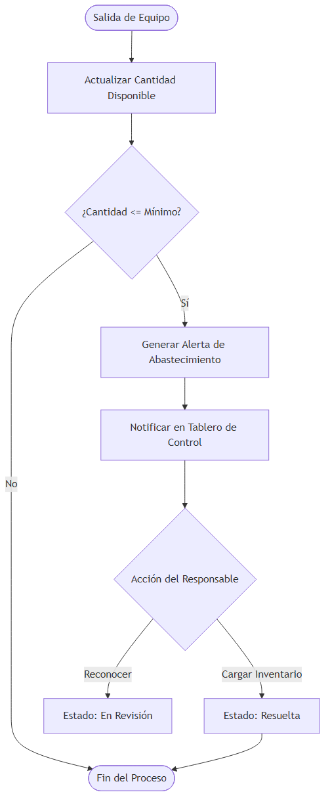

### Flujo Detallado

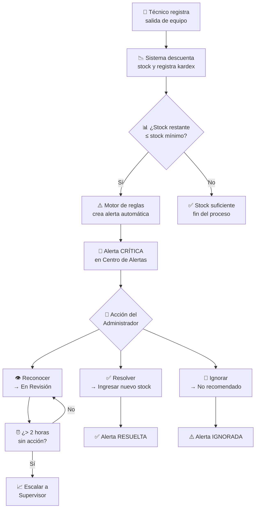
```mermaid
flowchart TD
    A[🔧 Técnico registra<br/>salida de equipo] --> B[📉 Sistema descuenta<br/>stock y registra kardex]
    B --> C{📊 ¿Stock restante<br/>≤ stock mínimo?}
    C -->|Sí| D[⚠️ Motor de reglas<br/>crea alerta automática]
    C -->|No| E[✅ Stock suficiente<br/>fin del proceso]
    D --> F[📢 Alerta CRÍTICA<br/>en Centro de Alertas]
    F --> G{👤 Acción del<br/>Administrador}
    G --> H[👁️ Reconocer<br/>→ En Revisión]
    G --> I[✅ Resolver<br/>→ Ingresar nuevo stock]
    G --> J[🚫 Ignorar<br/>→ No recomendado]
    H --> K[⏰ ¿> 2 horas<br/>sin acción?]
    K -->|Sí| L[📈 Escalar a<br/>Supervisor]
    K -->|No| H
    I --> M[✅ Alerta RESUELTA]
    J --> N[⚠️ Alerta IGNORADA]
```

**Secuencia de eventos:**

| # | Evento | Actor | Descripción |
|:---:|---|---|---|
| 1 | Salida de inventario | Técnico | Registra movimiento de salida |
| 2 | Descuento de stock | Sistema | Actualiza kardex y stock actual |
| 3 | Evaluación de regla | Motor | ¿Stock ≤ stock_minimo? |
| 4 | Creación de alerta | Sistema | Alerta con prioridad **CRÍTICA** |
| 5 | Reconocimiento | Admin | Marca como "En Revisión" |
| 6 | Resolución | Admin | Ingresa nuevo stock |
| 7 | Escalamiento | Sistema | Si > 2h sin reconocer → Supervisor |

> [!TIP]
> El motor de reglas (`evaluar_alertas`) genera la alerta crítica de stock bajo y el centro de alertas permite **reconocer, resolver e ignorar**. El **escalamiento automático por SLA** (críticas sin reconocer > 2 horas hacia el supervisor) está **pendiente para una versión futura**.

---

## 4. Flujo de Creación de Acta de Entrega {#4-flujo-de-creacion-de-acta-de-entrega}

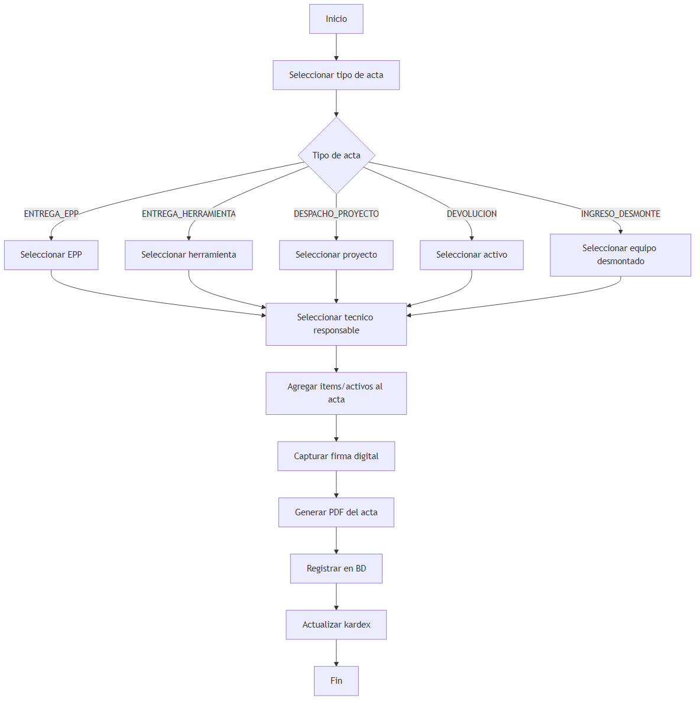

*Diagrama de flujo de creación de actas de entrega*

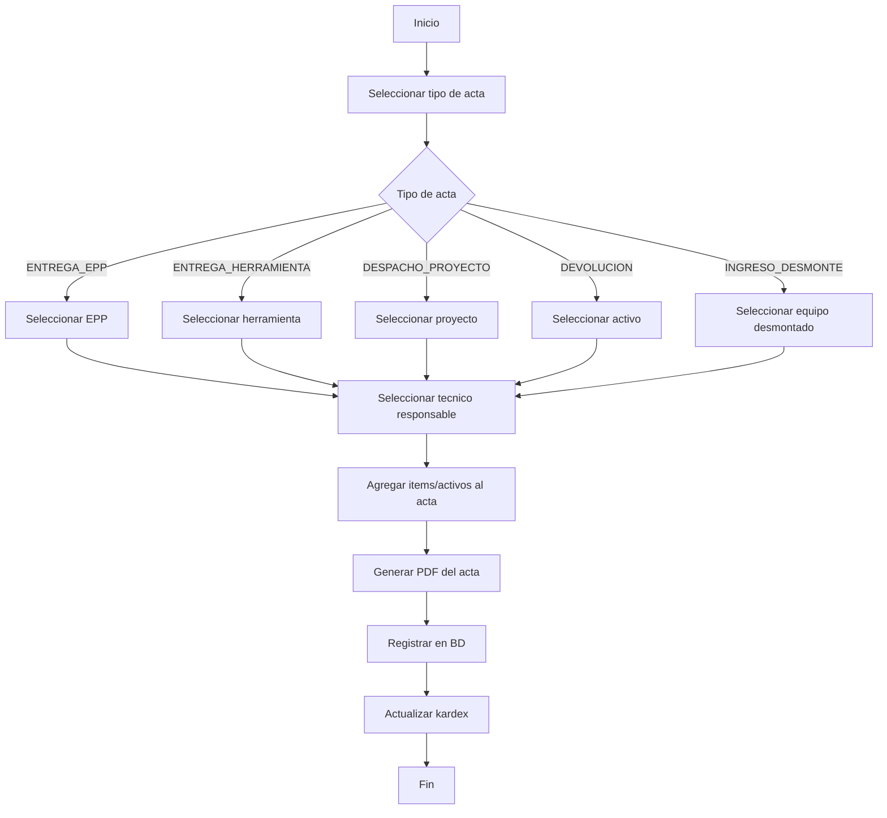
```mermaid
flowchart TD
    A[Inicio] --> B[Seleccionar tipo de acta]
    B --> C{Tipo de acta}
    C -->|ENTREGA_EPP| D[Seleccionar EPP]
    C -->|ENTREGA_HERRAMIENTA| E[Seleccionar herramienta]
    C -->|DESPACHO_PROYECTO| F[Seleccionar proyecto]
    C -->|DEVOLUCION| G[Seleccionar activo]
    C -->|INGRESO_DESMONTE| H[Seleccionar equipo desmontado]
    D --> I[Seleccionar tecnico responsable]
    E --> I
    F --> I
    G --> I
    H --> I
    I --> J[Agregar items/activos al acta]
    J --> K[Generar PDF del acta]
    K --> L[Registrar en BD]
    L --> M[Actualizar kardex]
    M --> N[Fin]
```

> [!IMPORTANT]
> La generación de actas crea un **PDF** con los datos del acta, sus items y los datos del técnico y representante.

---

## 5. Flujo de Importación Excel {#5-flujo-de-importacion-excel}

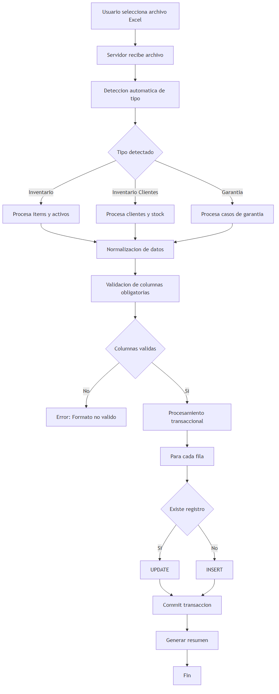

*Diagrama de flujo del proceso de importación de datos desde Excel*

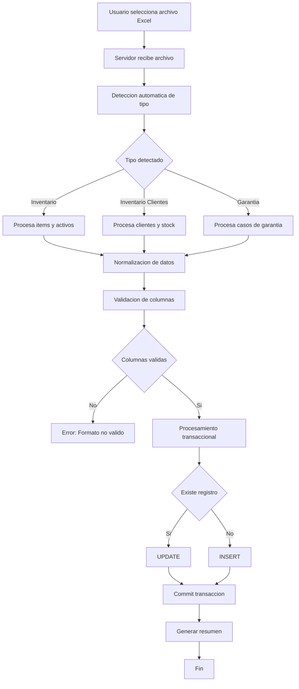
```mermaid
flowchart TD
    A[Usuario selecciona archivo Excel] --> B[Servidor recibe archivo]
    B --> C[Deteccion automatica de tipo]
    C --> D{Tipo detectado}
    D -->|Inventario| E[Procesa items y activos]
    D -->|Inventario Clientes| F[Procesa clientes y stock]
    D -->|Garantia| G[Procesa casos de garantia]
    E --> H[Normalizacion de datos]
    F --> H
    G --> H
    H --> I[Validacion de columnas]
    I --> J{Columnas validas}
    J -->|No| K[Error: Formato no valido]
    J -->|Si| L[Procesamiento transaccional]
    L --> M{Existe registro}
    M -->|Si| N[UPDATE]
    M -->|No| O[INSERT]
    N --> P[Commit transaccion]
    O --> P
    P --> Q[Generar resumen]
    Q --> R[Fin]
```

> [!NOTE]
> El proceso es **transaccional**: si falla alguna fila, **todo** se revierte (rollback). No hay importaciones parciales.

---

## 6. Flujo de Autenticación {#6-flujo-de-autenticacion}

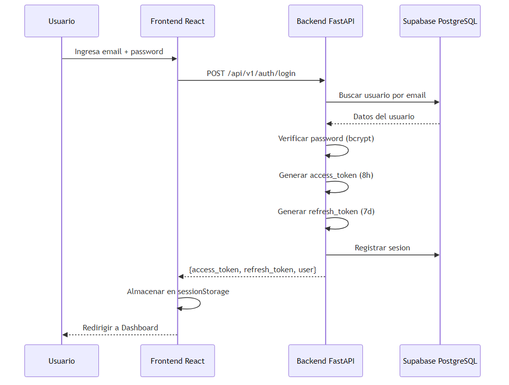

*Diagrama de secuencia del flujo de autenticación JWT*

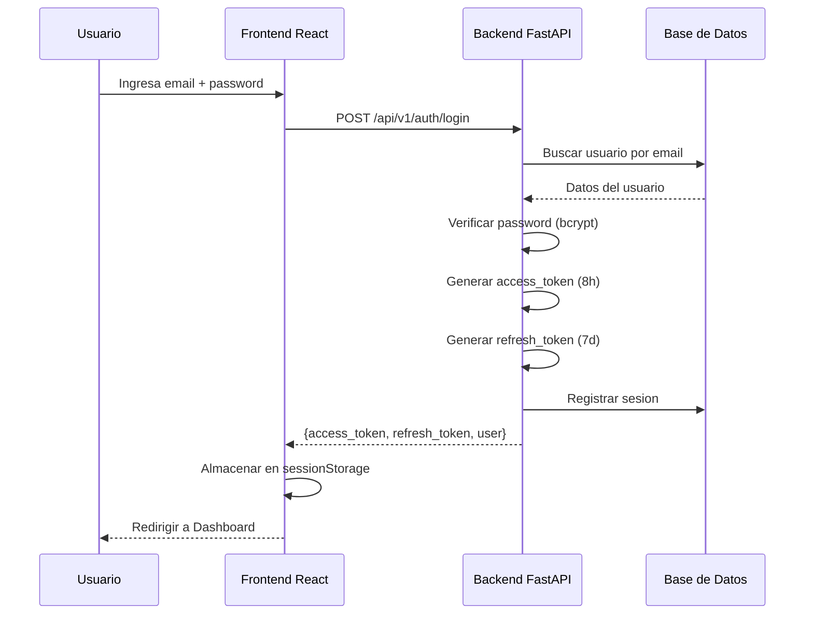
```mermaid
sequenceDiagram
    participant U as Usuario
    participant F as Frontend React
    participant B as Backend FastAPI
    participant D as Base de Datos

    U->>F: Ingresa email + password
    F->>B: POST /api/v1/auth/login
    B->>D: Buscar usuario por email
    D-->>B: Datos del usuario
    B->>B: Verificar password (bcrypt)
    B->>B: Generar access_token (8h)
    B->>B: Generar refresh_token (7d)
    B->>D: Registrar sesion
    B-->>F: {access_token, refresh_token, user}
    F->>F: Almacenar en sessionStorage
    F-->>U: Redirigir a Dashboard
```

> [!TIP]
> El flujo de **refresco automático** está implementado en el **interceptor Axios**. No requiere acción del usuario.

---

## 7. Flujo de Registro de Usuario (Admin) {#7-flujo-de-registro-de-usuario-admin}

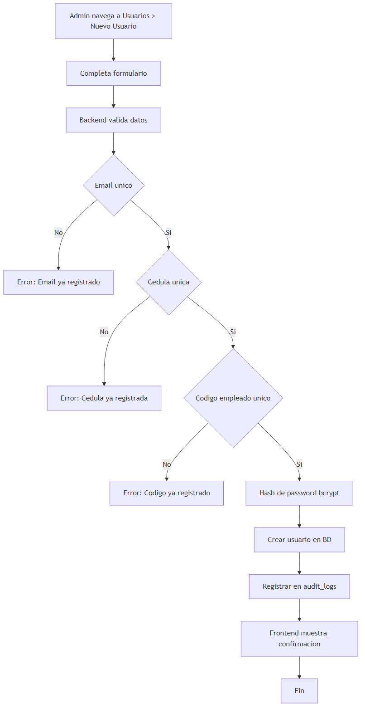

*Diagrama de flujo del proceso de registro de usuario por parte del administrador*

```mermaid
flowchart TD
    A[Admin navega a Usuarios > Nuevo Usuario] --> B[Completa formulario]
    B --> C[Backend valida datos]
    C --> D{Email unico}
    D -->|No| E[Error: Email ya registrado]
    D -->|Si| F{Cedula unica}
    F -->|No| G[Error: Cedula ya registrada]
    F -->|Si| H{Codigo empleado unico}
    H -->|No| I[Error: Codigo ya registrado]
    H -->|Si| J[Hash de password bcrypt]
    J --> K[Crear usuario en BD]
    K --> L[Registrar en audit_logs]
    L --> M[Frontend muestra confirmacion]
    M --> N[(Pendiente v1.1) Email automático]
    N --> O[Fin]
```

> [!WARNING]
> El envío de credenciales por **email** está **pendiente para v1.1.0**. Actualmente, el ADMIN debe entregar las credenciales manualmente al nuevo usuario.

---

> [!IMPORTANT]
> ¿Sugerencias o mejoras para estos diagramas? Abre un issue en el repositorio con la etiqueta `documentacion`.
