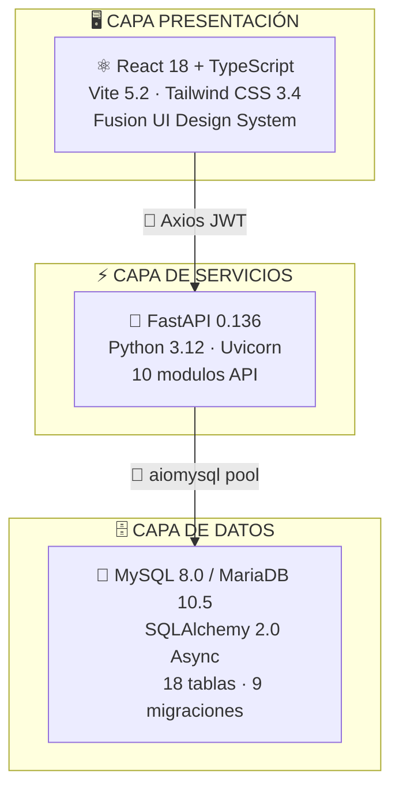
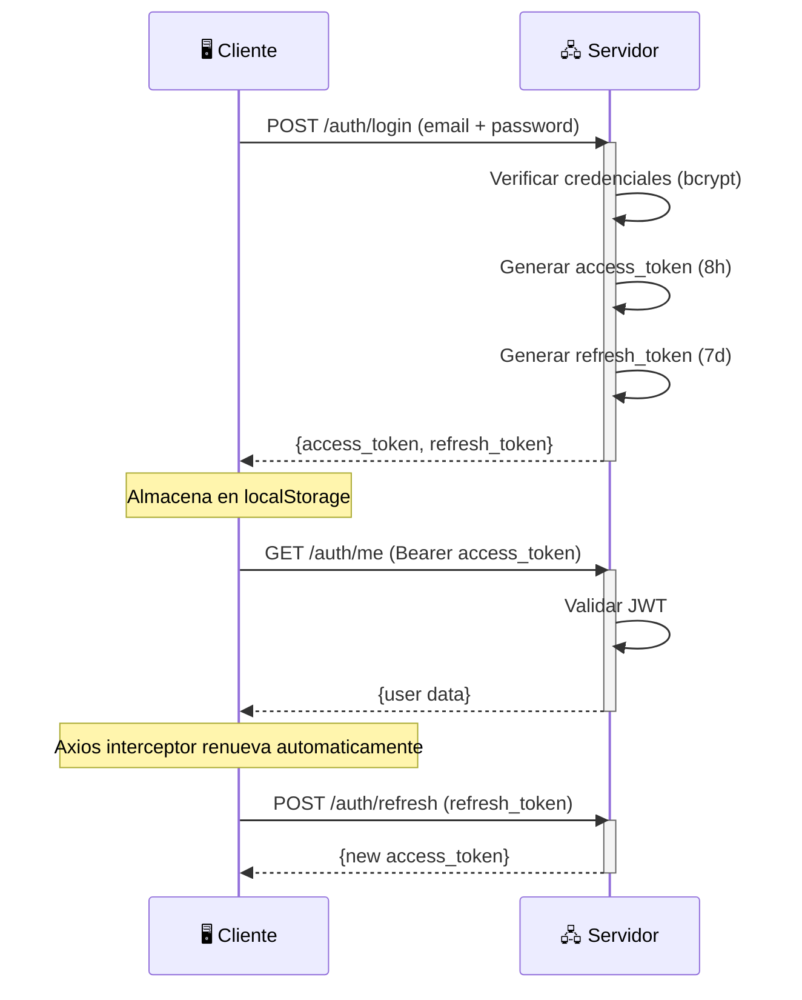
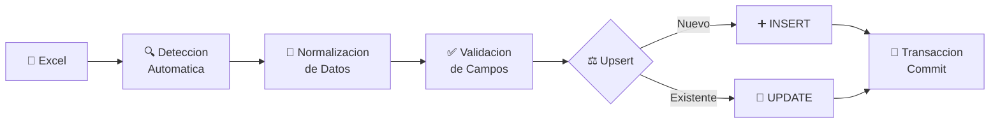
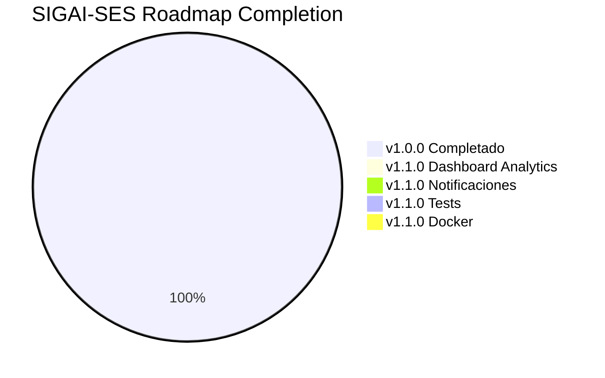

# Manual Técnico — SIGAI-SES

<div align="center">


</div>

---

> [!TIP]
> **Navegacion rapida:** [1. Intro](#1-introduccion) · [2. Arquitectura](#2-arquitectura-del-sistema) · [3. Backend](#3-estructura-del-backend) · [4. API](#4-api-endpoints-completos) · [5. Seguridad](#5-autenticacion-y-seguridad) · [6. Importacion](#6-importacion-de-datos) · [7. Reportes](#7-reportes) · [8. Frontend](#8-frontend) · [9. Mantenimiento](#9-mantenimiento-y-operaciones) · [10. Roadmap](#10-deuda-tecnica-y-roadmap)

---

## 1. Introduccion

> [!IMPORTANT]
> Este manual esta dirigido al **equipo de desarrollo** y **administradores de sistemas** responsables del mantenimiento, configuracion y operacion tecnica del **Sistema Integral de Gestion de Activos e Inventario (SIGAI-SES)** para **Securitas Colombia S.A.**

<div align="center">


</div>

---

## 2. Arquitectura del Sistema

### 2.1 Diagrama de Capas



### 2.2 Stack Tecnologico Detallado

| Componente | Tecnologia | Version |
|:---|---:|---:|
| Framework Backend |  | `0.136.1` |
| ORM |  | `2.0.49` |
| Base de Datos |  / MariaDB | `8.0+` |
| Migraciones |  | `1.18.4` |
| Autenticacion | `python-jose` + `bcrypt` | `3.5.0` / `4.0.1` |
| Framework Frontend |  (TypeScript) | `18.2.0` |
| Bundler |  | `5.2.0` |
| Estilos |  | `3.4.19` |
| Reportes | `XlsxWriter` + `ReportLab` | `3.2.9` / `4.5.1` |
| Excel | `Pandas` + `openpyxl` | `3.0.3` / `3.1.5` |
| HTTP Client |  | `1.6.8` |
| Estado FE |  | `5.101.0` |

---

## 3. Estructura del Backend

### 3.1 Arbol de Directorios

```
Backend/
├── app/
│   ├── main.py                    # Punto de entrada FastAPI
│   ├── core/
│   │   ├── config.py                 # Configuracion (Settings)
│   │   └── security.py               # JWT + bcrypt helpers
│   ├── db/
│   │   └── session.py                # AsyncSession, engine, Base
│   ├── models/                    # Modelos SQLAlchemy
│   │   ├── user.py                   # Usuario, Regional, SesionUsuario
│   │   ├── inventory.py              # Item, Activo, StockBulk, Movimiento, etc.
│   │   ├── business.py               # Cliente, Proveedor, Proyecto
│   │   ├── deliveries.py             # ActaEntrega, DetalleActaEntrega
│   │   ├── guarantees.py             # Garantia
│   │   ├── alerts.py                 # Alert, AlertRule
│   │   └── audit.py                  # AuditLog
│   ├── schemas/                   # Schemas Pydantic
│   │   ├── auth.py                   # Token, TokenData
│   │   ├── user.py                   # Usuario, UsuarioCreate, UsuarioUpdate
│   │   ├── inventory.py              # Item, Activo, Movimiento, EPP, etc.
│   │   ├── business.py               # Cliente, Proyecto, Proveedor, Garantia
│   │   ├── deliveries.py             # ActaEntrega, DetalleActa
│   │   ├── alerts.py                 # AlertRead, AlertUpdate
│   │   ├── audit.py                  # AuditLog
│   │   └── tracking.py               # EPP, HistorialUbicacion (legacy)
│   ├── crud/                      # Operaciones CRUD asincronas
│   │   ├── crud_user.py
│   │   ├── crud_inventory.py
│   │   ├── crud_business.py
│   │   ├── crud_alerts.py
│   │   ├── crud_analytics.py
│   │   ├── crud_audit.py
│   │   └── crud_deliveries.py
│   ├── api/
│   │   ├── deps.py                   # Dependencias (get_current_user)
│   │   └── endpoints/                # Handlers de rutas
│   │       ├── auth.py
│   │       ├── users.py
│   │       ├── inventory.py
│   │       ├── business.py
│   │       ├── analytics.py
│   │       ├── reports.py
│   │       ├── alerts.py
│   │       ├── regionales.py
│   │       └── import_data.py
│   └── services/
│       └── import_service.py         # Motor de importacion Excel
├── migrations/                    # Scripts Alembic (9 versiones)
├── tests/
│   └── test_import_service.py
├── requirements.txt
├── alembic.ini
└── .env
```

> [!TIP]
> La arquitectura sigue el patron **Repository + Service**: los CRUD estan separados de los servicios de negocio.

### 3.2 Modelos de Base de Datos

---

<details>
<summary><b>Tabla: <code>usuarios</code></b></summary>

| Campo | Tipo | Descripcion |
|:---|---:|---:|
| `id_usuario` | `INTEGER PK` | Identificador unico |
| `nombre` | `VARCHAR(100)` | Nombre completo |
| `email` | `VARCHAR(100) UK` | Correo electronico (login) |
| `password_hash` | `VARCHAR(255)` | Hash bcrypt de la contrasena |
| `rol` | `ENUM('ADMIN','TECNICO','TECNICO_LABORATORIO')` | Perfil de acceso |
| `id_regional` | `INTEGER FK` | Regional asignada |
| `cedula` | `VARCHAR(20) UK` | Numero de cedula |
| `codigo_empleado` | `VARCHAR(20) UK` | Codigo interno Securitas |
| `is_active` | `BOOLEAN` | Estado de la cuenta |
| `created_at` | `TIMESTAMP` | Fecha de creacion |

</details>

<details>
<summary><b>Tabla: <code>items</code></b></summary>

| Campo | Tipo | Descripcion |
|:---|---:|---:|
| `id_item` | `INTEGER PK` | Identificador unico |
| `categoria` | `ENUM(8 categorias)` | Categoria del equipo |
| `sub_categoria` | `VARCHAR(100)` | Subcategoria |
| `nombre_equipo` | `VARCHAR(255)` | Nombre del producto |
| `marca` | `VARCHAR(100)` | Marca del fabricante |
| `referencia` | `VARCHAR(100) UK` | Referencia del fabricante |
| `codigo_item_interno` | `VARCHAR(50) UK` | Codigo SAP/CECO interno |
| `stock_minimo` | `INTEGER` | Umbral para alerta de reabastecimiento |
| `compra_maxima` | `INTEGER` | Cantidad maxima por orden de compra |
| `costo_unitario` | `DECIMAL(12,2)` | Costo unitario |
| `moneda` | `ENUM('COP','USD','EUR')` | Moneda del costo |

</details>

<details>
<summary><b>Tabla: <code>activos</code></b></summary>

| Campo | Tipo | Descripcion |
|:---|---:|---:|
| `id_activo` | `INTEGER PK` | Identificador unico |
| `id_item` | `INTEGER FK` | Referencia al catalogo de items |
| `serial` | `VARCHAR(100) UK` | Numero de serie del equipo |
| `estado_actual` | `ENUM(8 estados)` | Estado operativo actual |
| `condicion_fisica` | `ENUM(6 condiciones)` | Condicion fisica evaluada |
| `ubicacion_fisica` | `VARCHAR(255)` | Ubicacion actual |
| `area_asignada` | `VARCHAR(100)` | Area especifica del cliente |
| `responsable_sitio` | `VARCHAR(100)` | Persona responsable en sitio |
| `id_proyecto_actual` | `INTEGER FK` | Proyecto donde esta asignado |
| `id_cliente_actual` | `INTEGER FK` | Cliente donde esta instalado |
| `fecha_compra` | `DATE` | Fecha de adquisicion |
| `activo_fijo_securitas` | `VARCHAR(50)` | Placa de activo fijo |
| `calificacion_tecnica` | `ENUM('BUENO','RECUPERABLE','DESECHO')` | Evaluacion tecnica |

</details>

<details>
<summary><b>Tabla: <code>garantias</code></b></summary>

| Campo | Tipo | Descripcion |
|:---|---:|---:|
| `id_garantia` | `INTEGER PK` | Identificador unico |
| `id_activo` | `INTEGER FK` | Activo en garantia |
| `id_proveedor` | `INTEGER FK` | Proveedor que atiende la garantia |
| `numero_caso_interno` | `VARCHAR(50) UK` | Numero de caso `GSES-XXX` |
| `rma_proveedor` | `VARCHAR(50)` | Numero RMA del proveedor |
| `estado_proceso` | `ENUM(5 estados)` | Estado del flujo de garantia |
| `fecha_envio` | `DATE` | Fecha de envio al proveedor |
| `fecha_limite_estimada` | `DATE` | Fecha limite de respuesta |
| `tipo_resolucion` | `ENUM('REPARADO','REEMPLAZADO','SIN_COBERTURA','PENDIENTE')` | Resolucion final |
| `falla_reportada` | `TEXT` | Descripcion de la falla |

</details>

<details>
<summary><b>Tabla: <code>audit_logs</code></b></summary>

| Campo | Tipo | Descripcion |
|:---|---:|---:|
| `id_log` | `INTEGER PK` | Identificador unico |
| `id_usuario` | `INTEGER FK` | Usuario que realizo la accion |
| `tabla_afectada` | `VARCHAR(50)` | Tabla modificada |
| `accion` | `ENUM('CREATE','UPDATE','DELETE','LOGIN')` | Tipo de accion |
| `id_registro` | `INTEGER` | ID del registro afectado |
| `valor_anterior` | `TEXT` | Valor antes del cambio (JSON) |
| `valor_nuevo` | `TEXT` | Valor despues del cambio (JSON) |
| `fecha_accion` | `TIMESTAMP` | Fecha y hora de la accion |

</details>

---

## 4. API Endpoints Completos

### 4.1 Autenticacion (`/api/v1/auth`)

| Metodo | Endpoint | Acceso | Descripcion |
|:---:|:---|---:|---:|
| `POST` | `/login` | Publico | Iniciar sesion (OAuth2 form) |
| `POST` | `/refresh` | Publico | Renovar access token |
| `POST` | `/logout` | Autenticado | Revocar sesion |
| `POST` | `/register` | ADMIN | Registrar usuario |
| `GET` | `/me` | Autenticado | Obtener usuario autenticado |

### 4.2 Usuarios (`/api/v1/users`)

| Metodo | Endpoint | Acceso | Descripcion |
|:---:|:---|---:|---:|
| `GET` | `/` | ADMIN | Listar usuarios (paginado) |
| `POST` | `/` | ADMIN | Crear usuario |
| `PUT` | `/{id}` | Autenticado | Actualizar usuario |
| `DELETE` | `/{id}` | ADMIN | Eliminar usuario |
| `GET` | `/audit` | ADMIN | Ver logs de auditoria |

### 4.3 Inventario (`/api/v1/inventory`)

| Metodo | Endpoint | Descripcion |
|:---:|---|---|
| `GET` | `/items` | Listar items (busqueda, paginado) |
| `POST` | `/items` | Crear item |
| `GET` | `/items/{id}` | Obtener item por ID |
| `PUT` | `/items/{id}` | Actualizar item |
| `DELETE` | `/items/{id}` | Eliminar item (soft delete) |
| `GET` | `/activos` | Listar activos (filtro por estado) |
| `POST` | `/activos` | Crear activo |
| `GET` | `/activos/{serial}` | Obtener activo por serial |
| `PUT` | `/activos/{id}` | Actualizar activo |
| `DELETE` | `/activos/{id}` | Eliminar activo |
| `PATCH` | `/activos/{id}/triaje` | Actualizar triaje |
| `GET` | `/activos/{id}/historial` | Historial de ubicaciones |
| `POST` | `/items/desmonte-bulk` | Registro masivo de desmontes |
| `GET` | `/epp` | Listar asignaciones EPP |
| `POST` | `/epp` | Crear asignacion EPP |

### 4.4 Negocio (`/api/v1/business`)

| Recurso | Metodos | Descripcion |
|:---|---:|---:|
| `clientes` | `GET/POST/PUT/DELETE` | CRUD completo |
| `proyectos` | `GET/POST/PUT/DELETE` | CRUD completo |
| `proveedores` | `GET/POST/PUT/DELETE` | CRUD completo |
| `garantias` | `GET/POST/PUT/DELETE` | CRUD completo |
| `movimientos` | `GET/POST` | CRUD completo |
| `actas` | `GET/POST` | CRUD + generacion PDF |

**Endpoints adicionales:**

| Metodo | Endpoint | Descripcion |
|:---:|---|---|
| `POST` | `/actas/generate` | Generar PDF desde datos inline |
| `POST` | `/actas/{id}/generate` | Generar PDF desde acta existente |
| `POST` | `/actas/{id}/downloaded` | Marcar acta como descargada |

### 4.5 Analiticas (`/api/v1/analytics`)

| Metodo | Endpoint | Descripcion |
|:---:|---|---|
| `GET` | `/summary` | Estadisticas del dashboard |
| `GET` | `/search` | Busqueda global rapida (min. 2 caracteres) |

### 4.6 Reportes (`/api/v1/reports`)

| Metodo | Endpoint | Descripcion |
|:---:|---|---|
| `GET` | `/export/{module}` | Exportar modulo a Excel/PDF |

**Modulos exportables:** `inventory` · `alerts` · `clientes` · `users` · `guarantees`

### 4.7 Alertas (`/api/v1/alerts`)

| Metodo | Endpoint | Descripcion |
|:---:|---|---|
| `GET` | `/` | Listar alertas (filtros: estado, prioridad, tipo) |
| `GET` | `/summary` | Resumen de alertas para dashboard |
| `POST` | `/` | Crear alerta manual |
| `PATCH` | `/{id}/estado` | Actualizar estado de alerta |
| `DELETE` | `/{id}` | Eliminar alerta |

### 4.8 Regionales (`/api/v1/regionales`)

| Metodo | Endpoint | Descripcion |
|:---:|---|---|
| `GET` | `/` | Listar todas las regionales |

### 4.9 Importacion (`/api/v1/import`)

| Metodo | Endpoint | Descripcion |
|:---:|---|---|
| `POST` | `/excel` | Importar archivo Excel (auto-detecta tipo) |
| `POST` | `/full-system` | Alias legacy para `/excel` |

---

## 5. Autenticacion y Seguridad

### 5.1 Flujo de Autenticacion



### 5.2 Politicas de Seguridad

| Política | Descripcion | Estado |
|:---|---:|:---:|
| Contrasenas | Hasheadas con `bcrypt` (salt automatico) | Implementado |
| Tokens JWT | Firmados con `HS256` | Implementado |
| Access token | Expira en **8 horas** (configurable) | Implementado |
| Refresh token | Expira en **7 dias** | Implementado |
| Sesiones revocables | Tabla `sesiones_usuario` | Implementado |
| Soft delete | Tablas criticas (`deleted_at`) | Implementado |
| Auditoria | Obligatoria en CREATE/UPDATE/DELETE | Implementado |
| CORS | Restringido a origenes configurados | Implementado |
| GZip | Compresion en respuestas > 500 bytes | Implementado |

> [!NOTE]
> Todas las politicas de seguridad estan implementadas y funcionales en **v1.0.0**.

---

## 6. Importacion de Datos

### 6.1 Motor de Importacion (`import_service.py`)



**Pipeline de procesamiento:**

| # | Fase | Descripcion |
|:---:|---|---|
| 1 | **Deteccion automatica** | Identifica tipo por columnas del archivo |
| 2 | **Normalizacion** | Estandariza formatos, mayusculas/minusculas |
| 3 | **Validacion** | Campos obligatorios y tipos de datos |
| 4 | **Upsert** | INSERT si no existe, UPDATE si existe |
| 5 | **Transaccional** | Todo o nada (commit/rollback) |

### 6.2 Formatos de Excel Soportados

<details>
<summary><b>Inventario</b></summary>

```
Serial │ Referencia │ Marca │ Equipo │ Ubicacion │ Estado │ Condicion │ Proyecto
```

</details>

<details>
<summary><b>Clientes</b></summary>

```
Nombre │ NIT │ Contacto │ Email │ Telefono │ Ciudad │ Departamento
```

</details>

<details>
<summary><b>Garantias</b></summary>

```
Serial │ Caso │ Proveedor │ Fecha Envio │ Estado │ Falla Reportada
```

</details>

> [!WARNING]
> Los nombres de columna deben coincidir **exactamente** con los esperados. Un error ortografico causara rechazo del archivo.

---

## 7. Reportes

### 7.1 Generacion de Reportes

| Formato | Libreria | Modo | Capacidad Maxima |
|:---|---:|:---|---:|
|  | **XlsxWriter** | `constant_memory` (streaming) | +30,000 registros |
|  | **ReportLab** | Tabla paginada | +30,000 registros |

> [!TIP]
> Ambos motores usan **streaming** para evitar problemas de memoria. Disenados para manejar grandes volumenes sin degradacion.

### 7.2 Modulos Exportables

| Modulo | Contenido |
|:---|---:|
| `inventory` | Items, activos, stock actual por bodega |
| `alerts` | Historial de alertas generadas |
| `clientes` | Listado completo de clientes |
| `users` | Usuarios del sistema con roles |
| `guarantees` | Casos de garantia con estados |

---

## 8. Frontend

### 8.1 Estructura de Rutas

| Ruta | Componente | Rol Minimo | Descripcion |
|:---:|:---:|:---:|:---|
| `/login` | `Login` | Publico | Autenticacion de usuarios |
| `/` | `Dashboard` | TECNICO | Panel principal con KPIs |
| `/inventory` | `Inventory` | TECNICO | Gestion de items y activos |
| `/alerts` | `Alerts` | TECNICO | Centro de alertas |
| `/clients` | `Clients` | TECNICO | Administracion de clientes |
| `/guarantees` | `Guarantees` | TECNICO | Seguimiento de garantias |
| `/audit` | `Audit` | ADMIN | Bitacora de auditoria |
| `/projects` | `Projects` | TECNICO | Gestion de proyectos |
| `/users` | `Users` | ADMIN | Administracion de usuarios |
| `/deliveries` | `Deliveries` | ADMIN | Actas de entrega |
| `/desmontes` | `Desmontes` | TECNICO_LAB | Triaje de equipos |

### 8.2 Sistema de Diseno (Fusion UI)

| Componente | Proposito |
|:---|---:|
| `Sidebar` + `Navbar` | Navegacion principal |
| `DashboardLayout` | Layout principal |
| `Card` · `Button` · `Modal` · `ConfirmModal` | UI base |
| `TableContainer` · `THead` · `TH` · `TBody` · `TR` · `TD` | Tablas |
| `Badge` | Estados y etiquetas |
| `NeoInput` · `NeoSelect` · `NeoTextarea` | Formularios neomorficos |
| `DonutChart` | Visualizaciones |

> [!NOTE]
> **Fusion UI** combina una paleta **Emerald Core** con elementos **Neomorphic Hub** para una experiencia visual moderna y coherente.

---

## 9. Mantenimiento y Operaciones

### 9.1 Respaldo de Base de Datos

```bash
# Respaldo completo
mysqldump -u usuario -p sigai_ses_db > respaldo_$(date +%Y%m%d).sql
```

### 9.2 Restauracion de Base de Datos

```bash
# Restaurar desde respaldo
mysql -u usuario -p sigai_ses_db < respaldo_20260701.sql
```

### 9.3 Migraciones

| Accion | Comando | Descripcion |
|:---|---:|---:|
| Crear | `alembic revision --autogenerate -m "descripcion"` | Nueva migracion |
| Aplicar | `alembic upgrade head` | Llevar a la ultima version |
| Revertir | `alembic downgrade -1` | Deshacer ultima migracion |

### 9.4 Monitoreo

| Recurso | Descripcion | Estado |
|:---|---:|:---:|
| Logs del servidor | Revisar `uvicorn` stdout/stderr | Implementado |
| Health check | `GET /health` → `{"status": "healthy"}` | Implementado |
| Metricas avanzadas | Prometheus/Grafana | Planificado (v1.1.0) |

> [!TIP]
> El endpoint `/health` es util para **load balancers** y **orquestadores** que necesitan verificar la disponibilidad del servicio.

---

## 10. Deuda Tecnica y Roadmap

### v1.0.0 (Actual) — Release Candidate

| Estado | Funcionalidad |
|:---:|---|
| | Funcionalidad completa operativa |
| | Importacion Excel con upsert |
| | Reportes con streaming |
| | Autenticacion JWT + bcrypt |
| | Auditoria completa |

### v1.1.0 (Planificado)

| Prioridad | Funcionalidad | Detalle |
|:---:|---:|:---|
| Alta | Dashboard analytics | Recharts desde backend |
| Media | Notificaciones push | SMTP / Email |
| Media | Tests automatizados | Ampliacion de cobertura |
| Baja | Dockerizacion | Entorno completo Docker Compose |

### Progreso del Proyecto



---

<div align="center">


</div>

> [!IMPORTANT]
> **Encontraste un error o tienes una sugerencia?** Abre un issue en el repositorio con el template correspondiente o contacta al equipo en `#sigai-ses-dev`.
