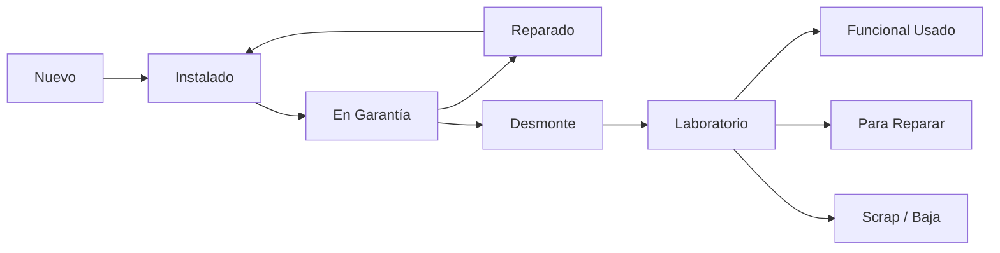
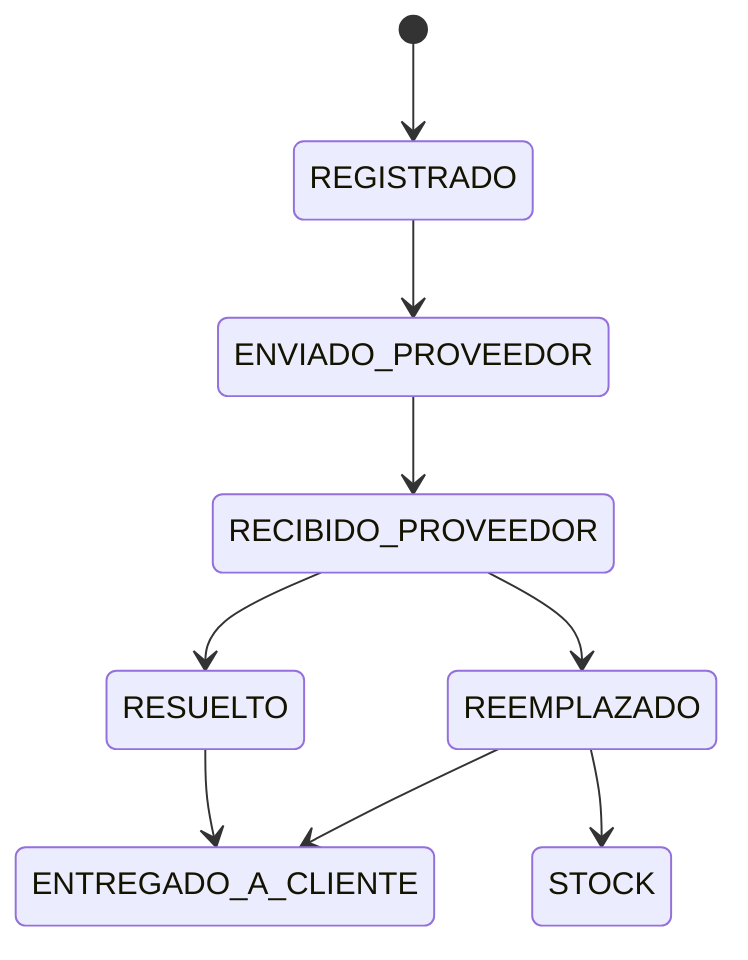
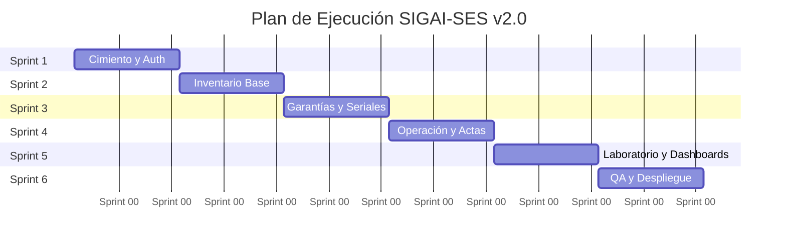

# PROPUESTA TÉCNICA: SIGAI — SES v2.0

<p align="center">
 <strong>Seguridad Electrónica Securitas</strong><br>
 <em>Sistema Integral de Gestión de Activos e Inventario</em>
</p>

<p align="center">
 
 
 
 
 
 
 
</p>

---

## Información General

|Campo|Detalle|
|:---|---|
|** Proyecto**|SIGAI - SES (Sistema Integral de Gestión de Activos e Inventario)|
|** Arquitecto Senior**|Gemini CLI (Sugerencias)|
|** Autor / Pasante**|Wilson Ortiz|
|** Programa**|Tecnología en Análisis y Desarrollo de Software — SENA|
|** Modalidad**|Pasantía|
|** Destinatario**|Elkin David Velásquez Hernández — Gerente de Mantenimiento, SES|
|** Versión**|2.0 (Revisión Senior)|
|** Fecha**|Mayo 2026|

---

## 1. Resumen Ejecutivo — Visión Senior

> [!IMPORTANT]
> SIGAI-SES **no es solo un gestor de inventario**; es una plataforma de **trazabilidad de activos de extremo a extremo**.

El sistema centralizará la operación de **Seguridad Electrónica Securitas**, transformando procesos manuales en Excel en **flujos de trabajo automatizados**.

La versión **2.0** introduce el concepto de **Kardex Digital Universal**, permitiendo conocer no solo *cuánto stock hay*, sino la **historia completa de cada serial**: desde su compra, pasando por instalaciones, desmontes de clientes, laboratorios de reparación, hasta su disposición final o cierre de garantía.

---

## 2. Arquitectura de Datos Refinada

> [!NOTE]
> Para resolver la duplicidad y falta de trazabilidad, el sistema se dividirá en **dos grandes lógicas de inventario**.

|Tipo|Descripción|Ejemplos|
|:----|:---|---|
|** Activos Serializados** (Equipos)|Cada unidad es única (Serial / Etiqueta QR). Se rastrea su estado individual.|Cámaras, DVR, sensores con N/S|
|** Artículos por Lote** (Consumibles/EPP)|Se rastrean por cantidades totales y unidades de medida.|Mts de cable, Und de conectores, Rollos|

### Ciclo de Vida del Activo Serializado



---

## 3. Stack Tecnológico — Justificación Técnica

|Capa|Tecnología|Justificación Senior|
|:----|:---|---|
|** Base de datos**|MySQL 8.0|Soporte para **JSON nativo** (ideal para logs de auditoría) y robustez relacional|
|** Backend**|FastAPI + SQLAlchemy 2.0|Alto rendimiento **asíncrono** y tipado fuerte para minimizar errores en tiempo de ejecución|
|** Frontend**|React 18 + Vite + Tailwind|Arquitectura de componentes **desacoplados** para máxima velocidad de carga|
|** Notificaciones**|Celery + Redis|Manejo de tareas en **segundo plano** para envío de correos y alertas sin bloquear el API|
|** Seguridad**|OAuth2 + JWT + Bcrypt|Estándares de la industria para **protección de datos sensibles**|
|** Reportes**|ReportLab / PyPDF2|Generación dinámica de **actas de entrega** con firmas digitales incrustadas|

> [!TIP]
> FastAPI + SQLAlchemy 2.0 fue seleccionado sobre Django por su **rendimiento asíncrono superior** y **menor overhead** en operaciones CRUD intensivas como las de inventario serializado.

---

## 4. Módulos Optimizados

### 4.1 Módulo de Garantías — Máquina de Estados

A diferencia de un registro plano, las garantías seguirán un **flujo lógico estricto**:



** Mejora clave:** Vinculación directa con el **serial del equipo** en stock para evitar errores de digitación.

### 4.2 Módulo de Stock y Kardex — Trazabilidad Total

> [!IMPORTANT]
> Toda transacción (Entrada, Salida, Traslado) generará un **registro inmutable** en la tabla `auditoria_stock`.

|Tipo|Descripción|
|:----|:---|
|** Entradas**|Compras nuevas o Devoluciones de técnicos|
|** Salidas**|Instalaciones en proyectos o Bajas por daño|
|** Traslados**|Movimientos entre Bodega Central y Laboratorio|

### 4.3 Módulo de Laboratorio y Desmontes

Gestión de equipos retirados de clientes corporativos.

**Proceso de Triaje:**

```
DESMONTE Técnico evalúa FUNCIONAL_USADO|PARA_REPARAR|SCRAP (Baja)
```

> [!WARNING]
> Un equipo en estado `SCRAP` debe requerir **aprobación de supervisor** antes de su disposición final, evitando bajas no autorizadas.

### 4.4 Módulo de Actas con Firma Digital

Generación de **documentos legales internos**.

- ** Captura de firma:** Implementación de **lienzo táctil** en el frontend para firmas en dispositivos móviles.
- ** Actas PDF:** Generación de **PDF inviolable** con sello de tiempo y datos del técnico/supervisor.

---

## 5. Diseño de Base de Datos — Estructura Sugerida

### 5.1 Entidades Core

|Entidad|Propósito|Campos Clave|
|:----|:---|---|
|**`items`**|Catálogo maestro|Descripción, Marca, Referencia, Stock Mínimo|
|**`activos`**|Instancias individuales|ID_Item, Serial, Estado_Actual, Ubicación_Actual|
|**`movimientos`**|El "Kardex"|ID_Activo/Item, Tipo, Cantidad, Usuario, Origen, Destino|
|**`garantias`**|Seguimiento de casos|ID_Activo, RMA, Proveedor, Fechas Límites|

<details>
<summary><b> Ver diagrama entidad-relación sugerido</b></summary>

```
┌──────────────┐ ┌──────────────┐ ┌────────────────┐
│ items │◄──────│ activos │──────►│ movimientos │
│ (catálogo) │1 N │ (seriales) │1 N │ (kardex) │
└──────────────┘ └──────┬───────┘ └────────────────┘
 │ 1
 │
 │ N
 ┌─────┴──────┐
 │ garantias │
 │ (RMA/caso) │
 └────────────┘
```

</details>

### 5.2 Roles de Usuario — RBAC

|Rol|Responsabilidades|
|:----|:---|
|** ADMIN**|Configuración global y auditoría de sistema|
|** BODEGUERO**|Gestión de entradas / salidas y control de stock físico|
|** SUPERVISOR**|Aprobación de actas y visualización de reportes ejecutivos|
|** TÉCNICO**|Consulta de inventario asignado y reporte de novedades en campo|

---

## 6. Sugerencias Estratégicas para la Implementación

<details>
<summary><b> Ver todas las sugerencias estratégicas</b></summary>

|#|Estrategia|Descripción|Beneficio|
|:-:|:----|:---|---|
|1|**Importador Masivo**|Herramienta de "Ingesta Inicial" que lea los archivos de inventario actuales para poblar el sistema en **un solo clic**|Reduce horas de carga manual a minutos|
|2|**QR Code Workflow**|Cada equipo en el laboratorio debe tener un QR. Escanearlo debe abrir inmediatamente su **historial de mantenimiento** y estado de garantía|Acceso instantáneo a trazabilidad en campo|
|3|**Alertas de Recompra Inteligentes**|El sistema debe sugerir la compra basándose no solo en el stock mínimo, sino en la **rotación** (consumo promedio de los últimos 3 meses)|Optimiza inventario y evita sobrecostos|
|4|**Offline-Ready (PWA)**|Permitir que el técnico vea su inventario asignado incluso si pierde conexión en un sótano o sitio remoto|Continuidad operativa sin internet|

</details>

> [!TIP]
> Priorizar el **Importador Masivo (1)** en el Sprint 1, ya que sin datos cargados no es posible probar los módulos subsecuentes.

---

## 7. Plan de Ejecución — 6 Sprints

<details open>
<summary><b> Timeline y entregables por sprint</b></summary>

|Sprint|Enfoque|Entregable Clave|Prioridad|
|:------:|:----|:---|---:|
|**1**|Cimiento y Auth|API de Usuarios + Modelos de BD + Login JWT|Crítica|
|**2**|Inventario Base|Gestión de Catálogo e Importación Masiva de Excel|Crítica|
|**3**|Garantías y Seriales|Flujo completo de Garantías con notificaciones por correo|Alta|
|**4**|Operación y Actas|Módulo de Salidas + Captura de Firma + Generación de PDF|Alta|
|**5**|Laboratorio y Dashboards|Módulo de Desmontes + Dashboard con KPIs|Media|
|**6**|QA y Despliegue|Pruebas Unitarias + Dockerización + Manual de Usuario|Media|

</details>



---

> [!NOTE]
> **Revisión técnica realizada por el Desarrollador Senior** — *SIGAI-SES v2.0* 
> **Enfoque:** Escalabilidad, Trazabilidad y Seguridad.

<p align="center">
 <sub>Documento generado como parte del programa de Pasantía SENA — Tecnología en Análisis y Desarrollo de Software</sub>
 <br>
 <sub>© 2026 — Seguridad Electrónica Securitas. Todos los derechos reservados.</sub>
</p>

