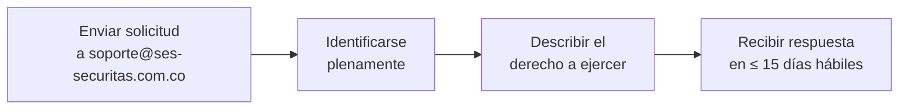

# **Aviso de Privacidad y Protección de Datos — SIGAI-SES**

<p align="center">
 
 
 
 
 
</p>

---

## 1. Identidad del Responsable

|Información|Detalle|
|---|---|
|**Empresa**|**Securitas Colombia S.A.**|
|**Unidad**|Seguridad Electrónica (SES)|
|**Sistema**|SIGAI-SES — Sistema Integral de Gestión de Activos e Inventario|
|**Contacto**|`soporte@ses-securitas.com.co`|

> [!IMPORTANT]
> De conformidad con la **Ley 1581 de 2012** y sus decretos reglamentarios, Securitas Colombia S.A. actúa como **Responsable del Tratamiento** de los datos personales contenidos en el sistema SIGAI-SES.

---

## 2. Datos Personales Recopilados

### 2.1 Usuarios del Sistema

|Dato|Finalidad|Clasificación|
|---|---|---|
|**Nombre completo**|Identificación del usuario|Público|
|**Correo electrónico corporativo**|Autenticación y comunicación|Sensible|
|**Cédula de ciudadanía**|Identificación única del empleado|Sensible|
|**Código de empleado**|Identificación interna Securitas|Interno|
|**Regional asignada**|Control de acceso por ubicación|Interno|
|**Registro de acciones (logs)**|Auditoría y trazabilidad|Crítico|

### 2.2 Clientes y Terceros

|Dato|Finalidad|Clasificación|
|---|---|---|
|**Nombre o razón social**|Identificación del cliente|Público|
|**NIT**|Identificación tributaria|Sensible|
|**Nombre de contacto**|Gestión comercial y operativa|Interno|
|**Correo electrónico**|Comunicación|Sensible|
|**Teléfono**|Coordinación de servicios|Interno|
|**Dirección y ciudad**|Ubicación de servicios|Interno|

---

## 3. Tratamiento de los Datos

### 3.1 Finalidades del Tratamiento

- **Gestión de inventario** de activos tecnológicos
- **Control de garantías** y mantenimiento de equipos
- **Asignación de equipos y EPP** a técnicos
- **Generación de actas** de entrega y desmontes
- **Auditoría de operaciones**
- **Cumplimiento de obligaciones contractuales** con clientes

### 3.2 Período de Conservación

> [!NOTE]
> Los datos personales se conservarán durante la **vigencia de la relación laboral o contractual**, y posteriormente por el tiempo necesario para cumplir con obligaciones legales y de auditoría **(mínimo 5 años)**.

```
 Línea de tiempo de retención:
├── Relación activa → Datos accesibles
├── Post-relación → 5 años (obligación legal)
└── Fin retención → Eliminación segura
```

---

## 4. Derechos del Titular (Ley 1581 de 2012)

> [!TIP]
> De acuerdo con la **Ley 1581 de 2012 de Colombia**, el titular de los datos tiene los siguientes **derechos ARCO+**:

|#|Derecho|Descripción|Procedimiento|
|---|---|---|---|
|1|**Acceso**|Conocer qué datos personales están siendo tratados|Solicitud escrita al administrador del sistema|
|2|**Consulta**|Solicitar información detallada sobre el uso de sus datos|Correo a `soporte@ses-securitas.com.co`|
|3|**Rectificación**|Solicitar corrección de datos inexactos|Módulo de usuarios o vía administrador|
|4|**Actualización**|Mantener sus datos al día|Actualización directa o vía administrador|
|5|**Supresión**|Solicitar eliminación de datos cuando ya no sean necesarios|Evaluación por oficial de protección de datos|
|6| **Revocación**|Revocar autorización para tratamiento de datos|Solicitud formal al responsable del tratamiento|

### Procedimiento para Ejercer sus Derechos



> [!WARNING]
> El titular debe presentar su solicitud **por escrito**, identificándose plenamente y describiendo el derecho que desea ejercer. La solicitud será respondida en un plazo máximo de **15 días hábiles**.

<details>
<summary><b> Ver formato de solicitud sugerido</b></summary>

```
Asunto: Ejercicio del derecho de [ACCESO / CONSULTA / RECTIFICACIÓN / 
 ACTUALIZACIÓN / SUPRESIÓN / REVOCACIÓN]

Yo, [NOMBRE_COMPLETO], identificado con cédula de ciudadanía 
No. [NÚMERO_CÉDULA], me dirijo a Securitas Colombia S.A. para 
solicitar el ejercicio del derecho de [DERECHO] sobre mis datos 
personales tratados en el sistema SIGAI-SES.

Solicito específicamente: [DETALLE_DE_LO_SOLICITADO]

Datos de contacto:
- Correo: [CORREO_ELECTRÓNICO]
- Teléfono: [TELÉFONO]

Atentamente,

[FIRMA]
[NOMBRE_COMPLETO]
[CÉDULA]
```

</details>

---

## 5. Seguridad de los Datos

> [!IMPORTANT]
> SIGAI-SES implementa las siguientes **medidas de seguridad técnicas y organizativas**:

|Medida|Descripción|Estado|
|---|---|---|
|**Autenticación**|Acceso mediante credenciales individuales (correo + contraseña)|Activo|
|**Encriptación**|Contraseñas protegidas con algoritmo **bcrypt**|Activo|
|**Autorización**|Control de acceso basado en roles (**RBAC**)|Activo|
|**Auditoría**|Registro detallado de todas las acciones en el sistema|Activo|
|**Transmisión**|Comunicación cifrada mediante **HTTPS** en producción|Activo|
|**Respaldo**|Copias de seguridad periódicas de la base de datos|Activo|

<details>
<summary><b> Ver detalle de medidas de seguridad</b></summary>

|Categoría|Medidas Implementadas|
|---|---|
|**Organizativas**|Políticas de acceso, cláusulas de confidencialidad, capacitación al personal|
|**Técnicas**|Autenticación OAuth2, JWT, bcrypt, RBAC, HTTPS, rate limiting|
|**Procedimentales**|Auditoría de acciones, backups periódicos, gestión de incidentes|
|**Legales**|Cumplimiento Ley 1581/2012, aviso de privacidad, derechos ARCO+|

</details>

---

## 6. Confidencialidad

> [!NOTE]
> Los datos personales recopilados por SIGAI-SES son de **uso exclusivo de Securitas Colombia S.A.** y **no serán compartidos con terceros** sin autorización expresa del titular, salvo obligación legal o contractual.

> [!WARNING]
> Los funcionarios con acceso al sistema están sujetos a **cláusulas de confidencialidad** y manejo de información. El incumplimiento de estas cláusulas puede dar lugar a acciones disciplinarias y legales.

---

## 7. Aceptación

> [!TIP]
> El uso del sistema **SIGAI-SES implica la aceptación** de este aviso de privacidad.

Al iniciar sesión, el usuario reconoce haber sido informado sobre el tratamiento de sus datos personales de acuerdo con lo establecido en la **Ley 1581 de 2012** y sus decretos reglamentarios.

```
┌─────────────────────────────────────────────┐
│ ACEPTACIÓN │
│ │
│ Al hacer clic en "Iniciar Sesión", usted │
│ acepta los términos de este aviso de │
│ privacidad. │
└─────────────────────────────────────────────┘
```

---

<p align="center">
 
 
 
</p>

> [!NOTE]
> **Documento controlado por:** Unidad de Seguridad Electrónica (SES) — Securitas Colombia S.A.

---

<p align="center">
 <sub>Aviso de Privacidad — SIGAI-SES · Securitas Colombia S.A. · Unidad de Seguridad Electrónica (SES)</sub>
</p>


