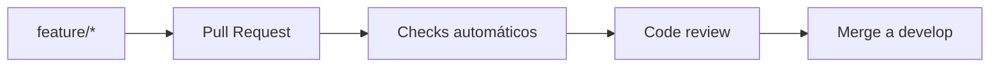
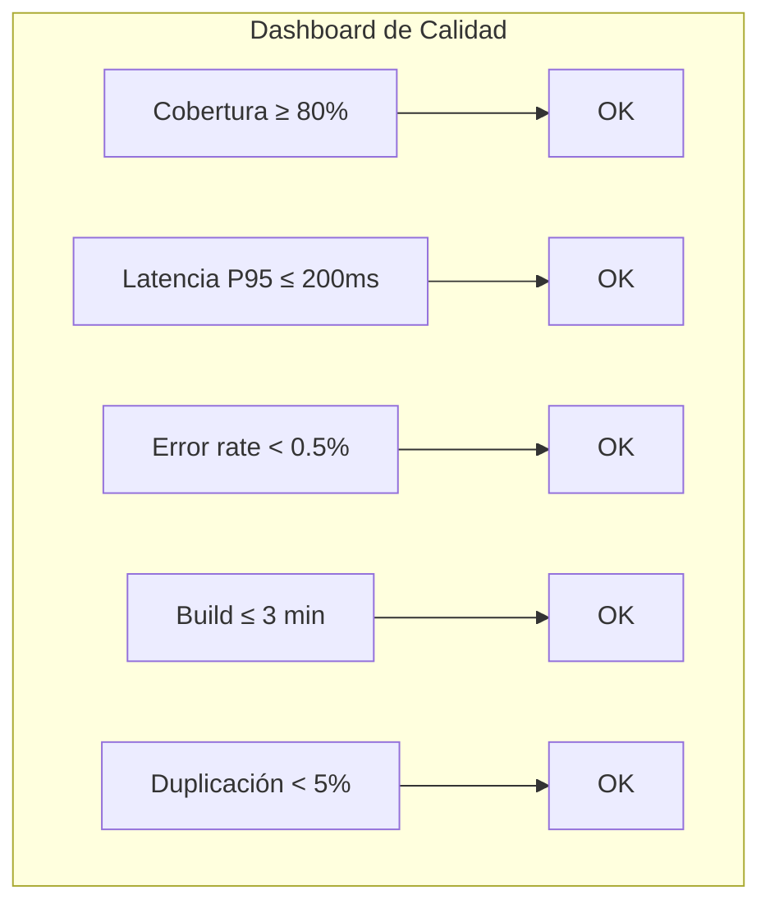
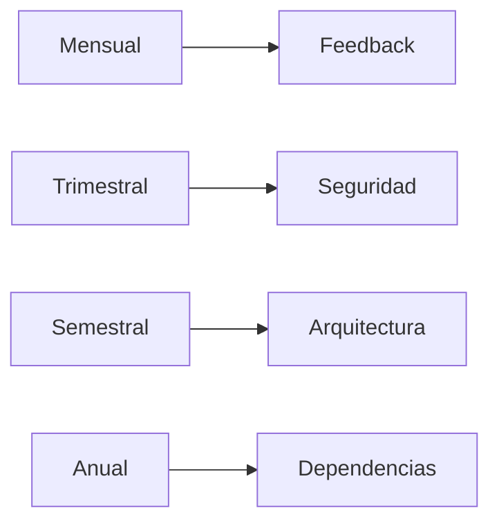

# **POLÍTICAS DE CALIDAD — SIGAI-SES**

<p align="center">
 
 
 
 
 
 
</p>

---

Este documento describe el **enfoque de calidad** adoptado para el proyecto **SIGAI-SES**, asegurando estándares profesionales en **desarrollo**, **despliegue** y **mantenimiento**.

---

## 1. Objetivos de Calidad

|Objetivo|Meta|Medición|Estado|
|---|---|---|---|
|**Disponibilidad**|**99.9%** del servicio|Monitoreo continuo con health checks|Crítico|
|**Seguridad**|Cumplimiento **OWASP Top 10**|Auditorías trimestrales|Crítico|
|**Rendimiento**|Respuesta **< 200ms** (operaciones críticas)|Métricas de latencia|Alto|
|**Mantenibilidad**|Cobertura de tests **≥ 80%**|Reportes de cobertura|Alto|
|**Documentación**|**100%** de módulos documentados|Revisión de entregables|Medio|

> [!IMPORTANT]
> Estos objetivos son **mandatorios** para cada release. El incumplimiento de cualquiera de ellos requiere una **justificación formal** y un **plan de remediación**.

---

## 2. Procesos Clave

### 2.1 Revisión de Código

|Requisito|Descripción|
|---|---|
|Todos los cambios requieren **Pull Request**|
|Mínimo **1 revisor** antes de merge|
|Checks automáticos: lint, tests, análisis estático|



### 2.2 Integración Continua (CI)

- **GitHub Actions** ejecuta tests en cada push
- Build automático del frontend
- Verificación de dependencias

### 2.3 Despliegue Continuo (CD)

- Despliegue automático a **staging**
- Pruebas de humo post-despliegue
- **Rollback automático** si falla

### 2.4 Gestión de Incidencias

> [!WARNING]
> Las incidencias se clasifican por **prioridad** con **SLAs** estrictos:

|Prioridad|SLA|Descripción|
|---|---|---|
|**P0**|**1 hora**|Sistema caído o pérdida de datos|
|**P1**|**4 horas**|Funcionalidad crítica afectada|
|**P2**|**24 horas**|Funcionalidad no crítica afectada|
|**P3**|**1 semana**|Mejora o bug menor|

```
 Tracking: Jira → Prioridades P0-P3
```

---

## 3. Métricas de Calidad

|Métrica|Umbral|Herramienta|Último valor|
|---|---|---|---|
|Cobertura de pruebas|**≥ 80%**|coverage.py / pytest|—|
|Tiempo de respuesta API|**≤ 200ms (P95)**|Locust / Prometheus|—|
|Tasa de errores HTTP|**< 0.5%**|Sentry / Logs|—|
|Tiempo de build frontend|**≤ 3 min**|GitHub Actions|—|
|Duplicación de código|**< 5%**|pylint / SonarQube|—|

<details>
<summary><b> Ver Dashboard de métricas sugerido</b></summary>



</details>

---

## 4. Seguridad

### 4.1 Prácticas Obligatorias

|#|Práctica|Descripción|
|---|---|---|
|1|**Contraseñas encriptadas**|Algoritmo **bcrypt**|
|2|**Tokens JWT con expiración**|**8h** access token, **7d** refresh token|
|3|**Rate limiting**|**10 req/min** en endpoints sensibles (login)|
|4|**CORS restringido**|Solo dominios autorizados|
|5|**Headers de seguridad**|X-Frame-Options, X-Content-Type-Options en Nginx|
|6|**HTTPS obligatorio**|Certificados Let's Encrypt|

> [!WARNING]
> Estas prácticas son **obligatorias** y verificadas en cada code review. Su incumplimiento **bloquea el merge**.

### 4.2 Auditorías

|Frecuencia|Actividad|Responsable|
|---|---|---|
|**Trimestral**|Revisión de dependencias y vulnerabilidades|DevOps|
|**Semestral**|Pentesting básico|Equipo de seguridad|
|**Anual**|Auditoría completa de seguridad|Firma externa|

---

## 5. Documentación

### 5.1 Tipos de Documentación

|Tipo|Formato|Actualización|Estado|
|---|---|---|---|
|**Técnica**|Markdown|Continua|Activo|
|**API**|OpenAPI 3.0 (Swagger)|Automática|Activo|
|**Usuario**|Markdown + PDF|Por release|Por definir|
|**Legal**|Markdown + PDF|Por release|Activo|

### 5.2 Estándares

- Todos los documentos incluyen **fecha y versión**
- Diagramas en **Mermaid** (renderizable en GitHub/GitLab)
- Código fuente como ejemplos ejecutables

> [!TIP]
> Usar **Mermaid** para diagramas garantiza que se rendericen correctamente en GitHub, GitLab y cualquier editor compatible con Markdown.

---

## 6. Mejoras Continuas

|Frecuencia|Actividad|Objetivo|
|---|---|---|
|**Mensual**|Retroalimentación del equipo|Identificar mejoras de proceso|
|**Trimestral**|Auditoría de seguridad|Detectar vulnerabilidades|
|**Semestral**|Revisión de arquitectura|Validar diseño del sistema|
|**Anual**|Actualización de dependencias mayores|Mantener stack actualizado|



---

## 7. Control de Versiones

### SemVer — `vMAJOR.MINOR.PATCH`

|Componente|Significado|Ejemplo|
|---|---|---|
|**MAJOR**|Cambios incompatibles en API|`v2.0.0`|
|**MINOR**|Nuevas funcionalidades compatibles|`v1.3.0`|
|**PATCH**|Bug fixes compatibles|`v1.0.1`|

### Ramas

|Rama|Propósito|Protegida|
|---|---|---|
|`main`|Producción|Sí|
|`develop`|Desarrollo|Sí|
|`feature/*`|Nuevas funcionalidades|No|
|`fix/*`|Correcciones|No|
|`release/*`|Preparación de release|Sí|

### Tags

```
 Cada release genera tag con changelog
Ejemplo: v1.0.0, v1.0.1, v1.1.0, v2.0.0
```

### Commits

> [!NOTE]
> Formato **convencional** para commits:

|Tipo|Uso|
|---|---|
|`feat:`|Nueva funcionalidad|
|`fix:`|Corrección de bug|
|`docs:`|Documentación|
|`chore:`|Mantenimiento|
|`refactor:`|Refactorización|
|`test:`|Pruebas|
|`style:`|Estilo de código|

```
Formato: <tipo>(<alcance opcional>): <descripción>

Ejemplos:
 feat(auth): add refresh token rotation
 fix(inventory): resolve N+1 query on item list
 docs: update README with deployment guide
```

---

<p align="center">
 
 
 
</p>

> [!NOTE]
> **Documento controlado por:** Unidad de Seguridad Electrónica (SES) — Securitas Colombia S.A.

---

<p align="center">
 <sub>Políticas de Calidad — SIGAI-SES · Securitas Colombia S.A. · Unidad de Seguridad Electrónica (SES)</sub>
</p>


