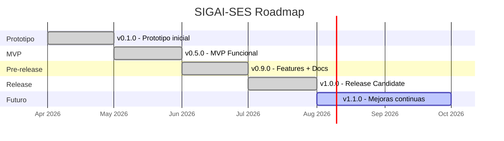



  
  
  
  

<h1 align="center">
  CHANGELOG - SIGAI-SES
</h1>

  <i>Sistema Integral de Gestion de Activos e Inventario</i> 
  <b>Securitas Colombia S.A. - Unidad de Seguridad Electronica (SES)</b>

  
  
  

---

## v1.0.0 (Julio 2026)

  

### Documentacion

> [!NOTE]
> Revision y unificacion completa de toda la documentacion del proyecto.

| Que | Descripcion |
|---|---|
| Fusion | Documentos de `DOCUMENTOS/` y `ENTREGABLES_SIGAI_SES/` unificados |
| README principal | Informacion detallada del stack, modulos y metricas |
| README tecnico | Estructura completa de backend y frontend |
| Arquitectura | ADRs, patrones de diseno y tabla de permisos |
| Diagramas de flujo | 7 flujos detallados (garantias, actas, importacion, autenticacion, usuarios) |
| Requisitos | Unificados: 24 RF (antes 13), 5 RNF, roadmap 6 sprints |
| Estado del proyecto | Hallazgos de auditoria y correcciones aplicadas |
| Manual administrador | Expandido de 57 a ~350 lineas (auditoria, actas, configuracion avanzada) |
| Informe seguridad | Hallazgos reales de auditoria y evaluacion OWASP detallada |
| FAQ tecnico | Docker, pool de BD, CORS, troubleshooting de migraciones |

### Documentos Nuevos

| # | Documento | Proposito |
|---|---|---|
| 1 | `06_GUIA_ON_PREMISE.md` | Despliegue en servidor corporativo local con Nginx + Systemd + Let's Encrypt |
| 2 | `07_PROCEDIMIENTOS_BACKUP.md` | Backup y Disaster Recovery con RPO/RTO, scripts automatizados |
| 3 | `08_CATALOGO_ERRORES_API.md` | Catalogo completo de errores HTTP por endpoint |
| 4 | `09_GUIA_MIGRACION_DATOS.md` | Migracion desde Excel legacy a SIGAI-SES |
| 5 | `10_PLAN_CAPACITACION.md` | Plan de capacitacion con modulos por perfil |

### Correcciones Detectadas y Aplicadas

| Hallazgo | Accion | Estado |
|---|---|---|
| Secretos en repo | `.env` saneados, creados `.env.example` | [CORREGIDO] |
| CORS permisivo | Configurable desde variable de entorno | [CORREGIDO] |
| Credenciales en locustfile | Ahora usa variables de entorno | [CORREGIDO] |
| UX inconsistente | ConfirmModal centralizado en Fusion.tsx | [CORREGIDO] |
| Logs/debug | `console.log` eliminados de Users.tsx | [CORREGIDO] |
| Lazy loading | `selectinload` en crud_deliveries | [CORREGIDO] |

---

## v0.9.0 (Junio 2026)

  

### Features Implementados

| Modulo | Descripcion | Progreso |
|---|---|---|
| Autenticacion | JWT completo con refresh token | [OK] 100% |
| Usuarios | CRUD con roles y regionales | [OK] 100% |
| Inventario | CRUD con items y activos serializados | [OK] 100% |
| Importacion Excel | Upsert con validacion | [OK] 100% |
| Dashboard | KPIs basicos | [OK] 100% |
| Garantias | Modulo completo | [OK] 100% |
| Actas de entrega | Firma digital incluida | [OK] 100% |
| Desmontes | Triaje (BUENO, RECUPERABLE, DESECHO) | [OK] 100% |
| Alertas | Motor automatico | [OK] 100% |
| Auditoria | Registro de acciones | [OK] 100% |

### Documentacion Creada

- Estructura completa de `ENTREGABLES_SIGAI_SES`
- Documentos tecnicos: instalacion backend/frontend, diccionario de datos, despliegue
- Documentos de gestion: requisitos, estado, acta de entrega
- Documentos de usuario: 24 HU, FAQ, manuales
- Documentos de calidad: plan de pruebas, seguridad, privacidad, calidad

---

## v0.5.0 (Mayo 2026)

  

### Funcionalidades Base

| Componente | Detalle | Progreso |
|---|---|---|
| Backend | FastAPI con SQLAlchemy async | [OK] 100% |
| Frontend | React + Vite + Tailwind | [OK] 100% |
| CRUD basico | Items y activos | [OK] 100% |
| Login | Basico con JWT | [OK] 100% |
| Base de datos | Conexion a MySQL | [OK] 100% |

### Documentacion Inicial

- Propuesta tecnica v2.0 (`PROPUESTA_GESTION_INVENTARIO_SES.md`)
- Especificacion de requisitos inicial
- Historias de usuario iniciales (6 HU)
- Documentos de arquitectura
- Plan de alertas (`gestion_alertas_ses.md`)

---

## v0.1.0 (Abril 2026)

  

### Base del Proyecto

| Componente | Estado |
|---|---|
| Configuracion del proyecto | [OK] Completo |
| Estructura backend | [OK] Creada |
| Estructura frontend | [OK] Creada |
| Modelos de base de datos | [OK] Primeros modelos |
| Documentacion inicial | [OK] Creada |

> [!NOTE]
> **Inicio del desarrollo.** Abril 2026 marca el nacimiento de SIGAI-SES.

---

## Linea de Tiempo

---

## Resumen de Versiones

| Version | Fecha | Estado | Cambios |
|---|---|---|---|
| **v1.0.0** | Julio 2026 | Release Candidate | Docs completas, 10 nuevos docs, correcciones de seguridad |
| **v0.9.0** | Junio 2026 | Pre-release | 10 modulos funcionales, documentacion completa |
| **v0.5.0** | Mayo 2026 | MVP Funcional | CRUD base, login, arquitectura inicial |
| **v0.1.0** | Abril 2026 | Prototipo | Configuracion inicial, estructura base |

---

  
  

  <i>Ultima actualizacion: Julio 2026</i>

